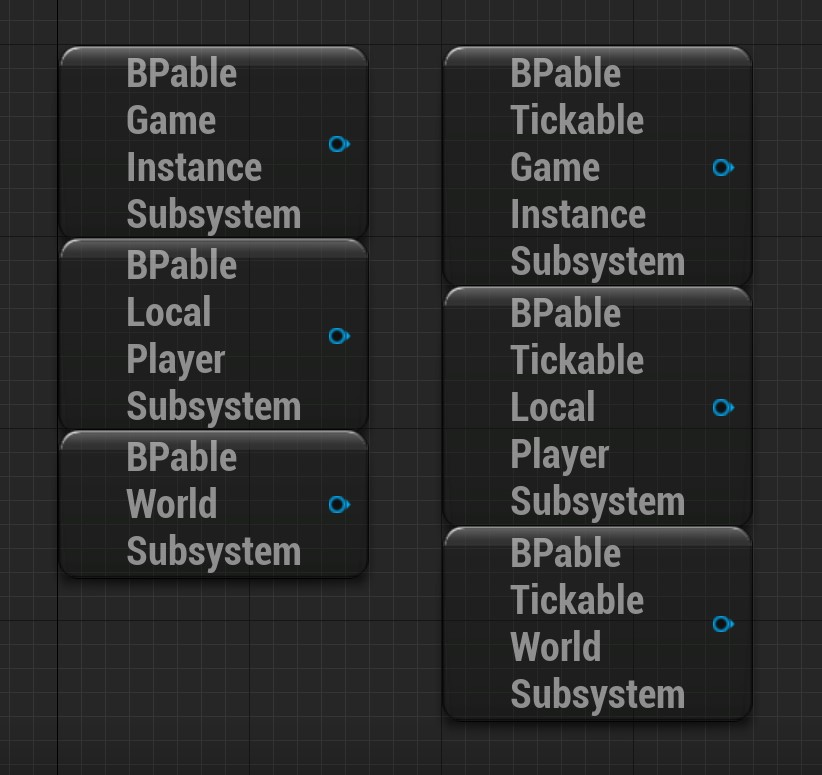
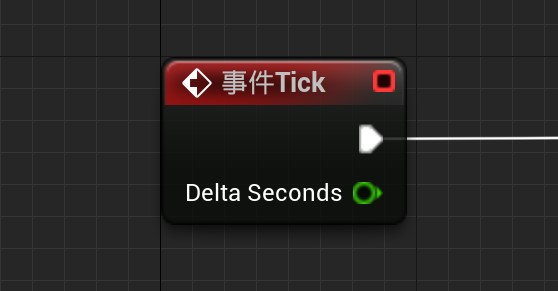
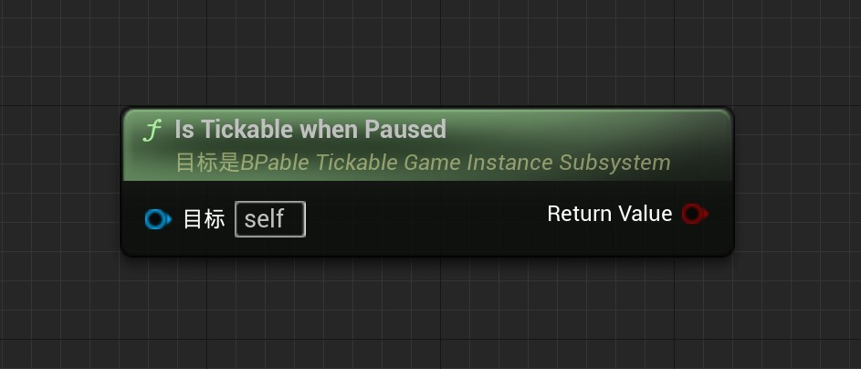

# 可蓝图化的子系统v1.5

## 插件简介

本插件提供了六个可蓝图继承的子系统：

BPable_GameInstanceSubsystem

BPable_LocalPlayerSubsystem

BPable_WorldSubsystem

BPable_TickableGameInstanceSubsystem

BPable_TickableLocalPlayerSubsystem

BPable_TickableWorldSubsystem

> 图中Get到的BPable子系统的这种用法**非法**。因为图中的这几个Subsystem是插件提供的基类，任何情况下都不应该获取它。
>
> 当然，用图中的方式获取你的子系统蓝图类是可以的。
>
> 关于该插件的使用方法在下文。上图仅仅时展示作用

用户直接通过蓝图继承这些基类就可以获得蓝图子系统。

## 快速启用

> 这里以BPable_GameInstanceSubsystem为例

- 打开项目的插件设置

  

- 确保BlueprintableSubsystem插件启用

- 在内容浏览器中创建蓝图类，并选取BPable_GameInstanceSubsystem为父类

  

- 或者你可以在内容浏览器中右键>蓝图>Subsystems中快速创建子系统

  

- 创建成功后打开你创建的游戏实例子系统蓝图类进行编辑

  

- 在其他蓝图类中使用Get Subsystem通用节点调用你创建的蓝图子系统（注意，如果你在创建子系统并保存后，没有在其他蓝图中并不能获取到你创建的蓝图子系统蓝图的引用，请重新启动编辑器。之后就可以获取到相应的引用了）

  

  

## 蓝图子系统

###  一般使用说明

在蓝图类编辑窗口左侧我的蓝图中点击重载相应的函数

请勿在 事件Initialize 和 事件Deinitialize 中使用需要提前知道World的节点（如GetActorOfClass、Delay）。

​	原因：Subsystem的 事件Initialize 和 事件Deinitialize 被执行时World尚未准备好或者在卸载中，所以此时执行诸如GetActorOfClass或Delay节点是无效的。

​	建议：在除了  事件Initialize 和 事件Deinitialize 之外的其他事件中使用这类节点，诸如WorldBeginPlay、Tick或者自定义事件

### 游戏实例子系统蓝图类

- 生命周期

  伴随其Outer，即UGameInstance

- 接口

  | 名称                  | 图示                                                         | 解释                                                         |
  | --------------------- | ------------------------------------------------------------ | ------------------------------------------------------------ |
  | Initialize            |  | 此子系统创建后调用的事件                                     |
  | WorldBeginPlay        |  | 此World开始执行BeginPlay时调用的事件                         |
  | WorldBeginTearDown    |  | 此World开始执行TearDown时调用的事件                          |
  | Deinitialize          |  | 此子系统被GC标记销毁前调用的事件                             |
  | ShouldCreateSubsystem |  | 此子系统创建前调用的函数，用于判断是否要创建该子系统单例。  可以不实现，不实现该接口时默认为创建。 实现函数后，若返回值为false则不创建，若返回值为true则创建。请留意 |

- 函数

  | 名称            | 图示                                                         | 解释                                                   |
  | --------------- | ------------------------------------------------------------ | ------------------------------------------------------ |
  | GetGameInstance |  | 获取游戏实例子系统的Outer，即游戏实例UGameInstance对象 |

  

---

### 本地玩家子系统蓝图类

- 生命周期

  伴随其Outer，即ULocalPlayer。

- 接口

  | 名称                  | 图示                                                         | 解释                                                         |
  | --------------------- | ------------------------------------------------------------ | ------------------------------------------------------------ |
  | Initialize            |  | 此子系统创建后调用的事件                                     |
  | WorldBeginPlay        |  | 此World开始执行BeginPlay时调用的事件                         |
  | WorldBeginTearDown    |  | 此World开始执行TearDown时调用的事件                          |
  | Deinitialize          |  | 此子系统被GC标记销毁前调用的事件                             |
  | ShouldCreateSubsystem |  | 此子系统创建前调用的函数，用于判断是否要创建该子系统单例。  可以不实现，不实现该接口时默认为创建。 实现时，若返回值为false则不创建，若返回值为true则创建。请留意 |

- 函数

  | 名称                     | 图示                                                         | 解释                                                         |
  | ------------------------ | ------------------------------------------------------------ | ------------------------------------------------------------ |
  | GetLocalPlayerController |  | 通过本地玩家子系统的Outer，即ULocalPlayer，获取ULocalPlayer对应的APlayerController。 执行Initialize时，这个节点返回值为null |

---

### 场景子系统蓝图类

- 生命周期

  伴随其Outer，即UWorld。仅在Game或PIE中生成

- 接口

  | 名称                   | 图示                                                         | 解释                                                         |
  | ---------------------- | ------------------------------------------------------------ | ------------------------------------------------------------ |
  | Initialize             |  | 此子系统创建后调用的事件                                     |
  | PostInitialize         |  | 此所有UWorldSubsystem调用Initialize后调用的事件              |
  | WorldBeginPlay         |  | 此当World准备好开始Gameplay、Gamemode转换到正确状态前和调用所有的Actor的Beginplay前调用的事 |
  | Deinitialize           |  | 此子系统被GC标记销毁前调用的事件                             |
  | ShouldCreateSubsystem  |  | 此子系统创建前调用的函数，用于判断是否要创建该子系统单例。  可以不实现，不实现该接口时默认为创建。 实现时，若返回值为false则不创建，若返回值为true则创建。请留意 |
  | WorldComponentsUpdated |  | 在世界组件（如所有关卡组件）被更新后被调用。                 |
  | UpdateStreamingState   |  | 更新子系统所需的流送关卡（由world的UpdateStreamingState函数调用）。 |

- 函数

| 名称            | 图示                                                         | 解释                     |
| --------------- | ------------------------------------------------------------ | ------------------------ |
| GetWorldSoftPtr |  | 获得世界子系统依赖的关卡 |

------

## 通用功能

### 有激活状态的子系统蓝图类

- 功能概述

  一个独立的激活状态，不对Subsystem本身产生实质影响，提供给用户的布尔状态

- 适用基类

  前缀是BPable的基类的子类

- 类默认值

  | 名称          | 解释           |
  | ------------- | -------------- |
  | ActiveDefault | 默认的激活状态 |

- 函数

  | 名称         | 图示                                                         | 解释                                                         |
  | ------------ | ------------------------------------------------------------ | ------------------------------------------------------------ |
  | IsActive     |  | 获取激活状态值                                               |
  | Activate     |  | 激活，并广播激活 参数bReset为真时，即使已经是激活的，仍会再激活一次。 |
  | Deactivate   |  | 反激活                                                       |
  | ToggleActive |  | 切换激活                                                     |
  | SetActive    |  | 设置激活状态 参数NewActive是要设置的新的值。 参数Reset是否为重设激活 |

- 委托

  | 名称                      | 解释                                                         |
  | ------------------------- | ------------------------------------------------------------ |
  | OnActivated(Object,Reset) | 激活后执行的委托 参数Object是分发委托的Subsystem的引用 参数Reset是激活时是否重设的激活 |
  | OnDeactivated(Object)     | 反激活后执行的委托 参数Object是分发委托的Subsystem的引用 |

---

### 可Tick的子系统蓝图类

- 功能概述

  有该功能子系统蓝图类可以随着每帧执行Tick事件。

  Tick事件会收到激活状态的影响。即使当前可以Tick，若未激活，则不执行Tick事件。

- 适用基类

  前缀是BPable_Tickable的基类的子类

- 类默认值

  | 名称                 | 解释                     |
  | -------------------- | ------------------------ |
  | IsTickEnabled        | 是否启用Tick             |
  | IsTickableThenPaused | 是否在游戏暂停后启用Tick |

- 事件

  部分接口继承自UBPable_GameInstanceSubsystem，请在父类中查看相关内容

  | 名称 | 图示                                                         | 解释                       |
  | ---- | ------------------------------------------------------------ | -------------------------- |
  | Tick |  | 启用了Tick后每帧调用的时间 |

- 函数

  | 名称                          | 图示                                                         | 解释                         |
  | ----------------------------- | ------------------------------------------------------------ | ---------------------------- |
  | SetTickEnabled                |  | 设置是否启用Tick             |
  | IsSubsystemTickEnabled        |  | 返回Tick启用的值             |
  | SetTickableWhenPaused         |  | 设置是否当游戏暂停时Tick     |
  | IsSubsystemTickableWhenPaused |  | 返回是否在游戏暂停时Tick的值 |

