# 串口通信 v0.1

## 插件简介

本插件期望提供一个符合虚幻C++编程环境下的串口编程所需要的API集，以及可以在蓝图中进行串口通信的函数集。

目前提供基本的串口通信，可以通过同步的方式（即阻塞游戏进程）或异步的方式（即不阻塞游戏线程）与串口通信。

这是作者第一次编写API封装相关的插件。如有不足，还请谅解。

如果你有很好的建议、改进需要以及在使用中遇到了意外错误，请发送反馈邮件到abc981140197@163.com

## 蓝图

### 蓝图使用案例

接下来的案例将展示简单的与一个串口进行收发。接入的串口设备是CH340，我将两个CH340对接来进行串口收发测试。


上图中，我创建了一个测试用Actor子类，并在BeginPlay之后进行创建串口。传入的两个结构体的值是其默认值。这里Name参数就是要打开的串口号。Synchronize默认勾选，其实勾选后也能进行异步操作，这里我保持默认值。

返回的结果是一个串口的句柄，在判断是否有效后将其保存为变量。

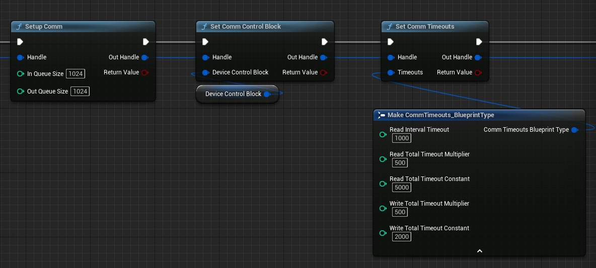

创建串口的句柄后要进行初始设置。

上图中，进行的第一个函数是初始化串口并分配缓冲区。第二个函数设置其DeviceControlBlock，其值如下图所示，这是默认值。第三个函数设置其超时参数。传入的超时设置结构体的值为默认值。

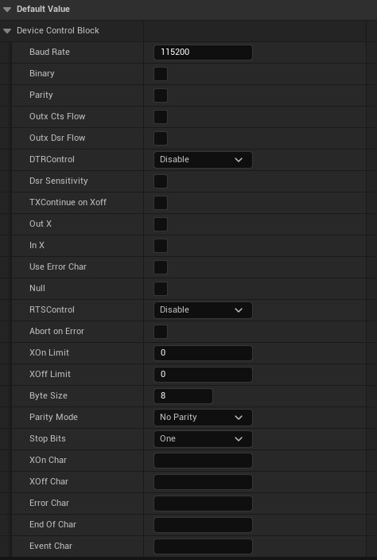


在设置所有的必须项后，调用函数清空了该句柄的缓冲区。传入的PurgeAction为默认值


**别忘了关闭串口！**这里为了简单测试，写在了该Actor的EndPlay时。


在句柄的有效周期内，可以调用AsyncWriteHandle来异步地写入串口的句柄


在句柄的有效周期内，可以调用AsyncReadHandle来异步地写入串口的句柄

---

### 蓝图API

#### 类型

- Handle

  句柄，对应Windows下的句柄。其内部存有一个void*。

  

- DesiredAccess

  用于表示句柄串口的访问类型

  

- ShareMode

  用于表示句柄串口的共享模式，串口一般设置为Exclusive

  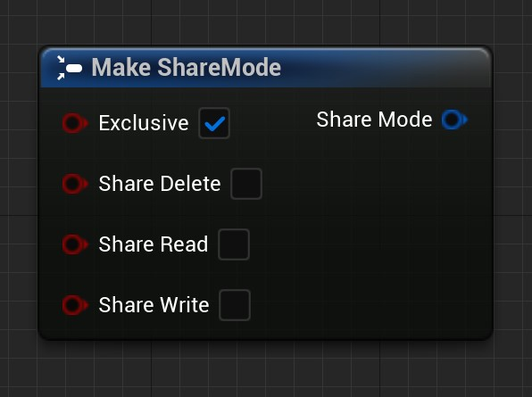

- DeviceControlBlock

  设备控制块，对应windows api下的_DCB结构体

  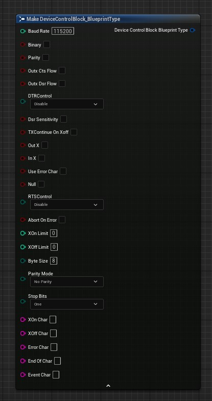

- CommTimeouts

  超时设置，对应windows api下的_COMMTIMEOUTS结构体

  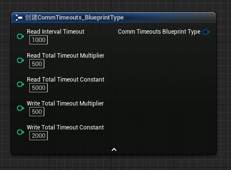

- CommStat

  句柄状态

  

- PurgeAction

  缓冲器清除操作。

  

- EventMask

  句柄事件遮罩

  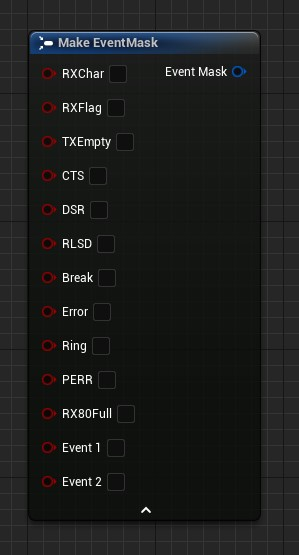

- CommErrors

  句柄错误

  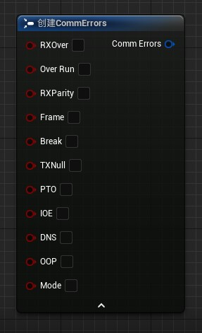

- Overlaped

  重叠操作，一般用于句柄的异步执行。建议不使用，因为插件已提供异步执行版本。

  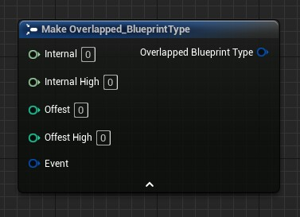

#### 函数

蓝图节点的解释将不在此处解释，在蓝图中这些节点的引脚部分有注释。

| 函数名                   | 图表                                                         | 函数简述                                                     |
| ------------------------ | ------------------------------------------------------------ | ------------------------------------------------------------ |
| Convert Handle to String |  | 将句柄转化为字符串。<br />其结果为Handle内部的void指针的地址值。 |
| Handle Is Valid          |  | 返回一个Handle是否有效。                                     |
| Handle Is Valid          | 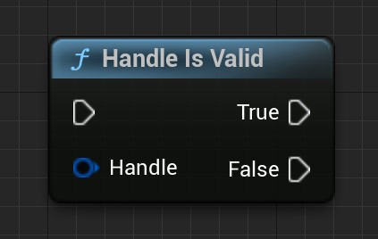 | 为上述函数的执行分支版本。                                   |
| Create Comm Handle       |  | 创建串口的句柄。<br />Synchronize为真时，仍可进行异步操作。  |
| Setup Comm               | 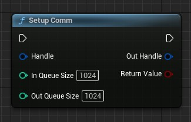 | 初始化串口，并分配缓冲区。                                   |
| Close Handle             |  | 关闭句柄。                                                   |
| Get Last Error Code      | 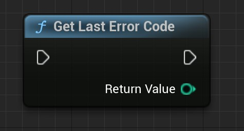 | 获取最后的错误码，该函数最终是GetLastError()的包装。错误码又该函数返回，详情请网络搜索该函数的返回值代表的含义。 |
| Clear Comm Error         |  | 清除串口错误。并获取串口的错误和状态。                       |
| Get Comm Control Block   |  | 获取串口的Device Control Block。                             |
| Set Comm Control Block   |  | 设置串口的Device Control Block。                             |
| Build Comm DCB           |  | 通过字符串构建串口DCB结构体。该函数为BuildCommDCB()的包装。具体的构建规则请网络搜索。 |
| Convert String to DCB    |  | 该函数为上述函数的Convert版本                                |
| Purge Comm               | 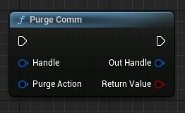 | 清空串口缓冲区。                                             |
| Flush Comm Buffers       | 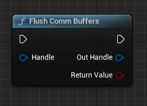 | 刷新串口的缓冲区                                             |
| Read Handle              |  | 同步地读串口                                                 |
| Async Read Handle        | 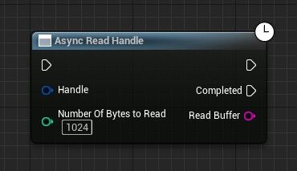 | 异步地读串口                                                 |
| Write Handle             |  | 同步地写串口                                                 |
| Async Write Handle       | 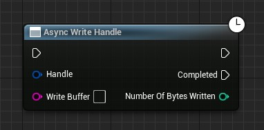 | 异步地写串口                                                 |
| Get Overlapped Result    |  | 获取重叠操作的结果。该函数是GetOverlappedResult()的包装。一般用于等待获取异步操作的结果。bWait为真时阻塞线程。建议不使用该函数，应该使用Async版本的函数。如上面的Async Read Handle节点。 |
| Get Comm Timeouts        | 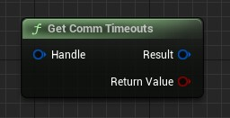 | 获取串口的超时参数。                                         |
| Set Comm Timeouts        |  | 设置串口的超时参数。                                         |
| Get Comm Event Mask      | 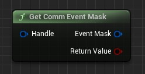 | 获取串口的事件遮罩                                           |
| Set Comm Event Mask      |  | 设置串口的事件遮罩                                           |
| Wait Comm Event          |  | 等待串口事件响应，这是一个同步操作。一般情况下请使用异步操作。 |
| Async Wait Comm Event    |  | 等待串口事件响应，这是一个异步操作。                         |


## CPP

### CPP使用案例

首先，你需要在使用该插件的函数库的模组中添加依赖项。

如，在该例子中，我将在一个项目文件中测试串口通信。

所以我先找到我的项目文件的.Build.cs文件，并在PublicDependencyModuleNames列表中添加"SerialPortCommunication"这样一个字段，这样我就能在项目代码中使用该模组的符号。

```c#
PublicDependencyModuleNames.AddRange(new string[] { "Core", "CoreUObject", "Engine", "InputCore" ,"SerialPortCommunication"});
```

然后我创建了一个Actor的子类，用于测试串口通讯。

创建成功后头文件添加

```c++
#include "WindowsCommProcessTypes.h"
```

并在类内添加了三个函数的声明和一个句柄变量:

```c++
#pragma once

#include "CoreMinimal.h"
// Add include
#include "WindowsCommProcessTypes.h"
#include "GameFramework/Actor.h"
#include "COMActorTest.generated.h"

UCLASS()
class YOURPROJECT_API ACOMActorTest : public AActor
{
	GENERATED_BODY()

public:
	ACOMActorTest();

protected:
	virtual void BeginPlay() override;

	FHandle Handle;

public:
	virtual void BeginDestroy() override;

	// Do Async Read
	UFUNCTION(CallInEditor)
	void AsyncRead();

	// Do Async Write
	UFUNCTION(CallInEditor)
	void AsyncWrite();

	// Receive Async Read
	UFUNCTION()
	void Print(FString String);
};
```

然后我在cpp文件中去实现它:

```c++
#include "COMActorTest.h"

#include "AsyncReadHandleAction.h"
#include "AsyncWriteHandleAction.h"
#include "WindowsCommProcess.h"

ACOMActorTest::ACOMActorTest()
{
   PrimaryActorTick.bCanEverTick = false;
}

void ACOMActorTest::BeginPlay()
{
   Super::BeginPlay();

   // Create Handle and Open Comm.
   Handle = FWindowsCommProcess::CreateCommHandle("COM5");

   // If it is not valid then return.
   if (!Handle)
   {
      return;
   }

   // Setup Comm Begin
   FWindowsCommProcess::SetupComm(Handle);
   FWindowsCommProcess::SetCommControlBlock(Handle, FDeviceControlBlock());
   FWindowsCommProcess::SetCommTimeouts(Handle, FCommTimeouts());
   // Setup Comm End

   // Clear Buffer
   FWindowsCommProcess::PurgeComm(Handle);

   // Print Log
   UE_LOG(LogTemp, Warning, TEXT("Handle Open Success"));
}

void ACOMActorTest::BeginDestroy()
{
   Super::BeginDestroy();

   // Make sure the serial port is closed.
   if (Handle)
   {
      FWindowsCommProcess::CloseHandle(Handle);
   }
}

void ACOMActorTest::AsyncRead()
{
   if (!Handle)
   {
      return;
   }

   // Create asynchronous read execution objects.
   auto Object = UAsyncReadHandleAction::AsyncReadHandle(Handle);
   
   // Binding delegates to receive callbacks.
   Object->OnReadCompleted.AddDynamic(this, &ACOMActorTest::Print);

   // Performing asynchronous operations.
   Object->Activate();
}

void ACOMActorTest::AsyncWrite()
{
   if (!Handle)
   {
      return;
   }
   
   // Execute asynchronous operations directly after creating an asynchronous write object.
   UAsyncWriteHandleAction::AsyncWriteHandle(Handle, "CppComTest")->Activate();
}

void ACOMActorTest::Print(FString String)
{
   // Callback function for printing the result after asynchronous reading.
   UE_LOG(LogTemp, Warning, TEXT("%s"), *String);
}
```

### CPP API

---

#### 注意事项

在代码文件中你可以找到两组关键文件，分别是

```
WindowsCommProcessTypes.h
WindowsCommProcess.h
```

和

```
CommTypesForBlueprint.h
CommFunctionLibrary.h
```

其中，前一组文件是可以用于虚幻C++串口编程使用的文件，其中包含了封装的类型和函数。你应该使用前一组文件进行串口编程。

后一组文件实现了将函数暴露给蓝图。后一组的类型和函数是对前一组的再次封装。

你在串口编程时应该以前一组文件的类型为准。

如果你需要进行拓展并想将拓展的C++函数暴露给蓝图，则暴露的部分应该参考后一组文件的实现。


该部分展示的所有类型和函数将以前一组文件内的定义为准。


由于本插件大部分都是对Windows串口编程API的封装，所以这里就不对绝大部分函数或类型作出解释了。详情请查看Windows有关串口 函数的说明文档。

---

#### 类型

```
EDesiredAccessFlag
```

串口访问标志，可以是多个值的组合。


```
EShareModeFlag
```

串口共享模式标志，可以是多个值的组合。对于串口，一般为独占模式。


```
ECommErrorsFlag
```

串口错误标志，可以是多个值的组合。


```
EEventMaskFlag
```

串口事件标志，可以是多个值的组合。


```
EFlagsAndAttributesFlag
```

串口属性描述，可以是多个值的组合。对于串口，一般只有Overlapped有用。


```
EPurgeActionFlag
```

串口缓冲区操作标志，可以是多个值的组合。

---

```
ECreationDisposition
```

创建操作枚举。对于串口，一般只有OpenExisting有用。


```
EDTRControl
```

DTR流控制枚举。


```
ERTSControl
```

RTS流控制枚举。


```
EParityMode
```

校验模式枚举。


```
EStopBits
```

停止位枚举

---

```
FHandle
```

句柄结构。其内部是一个void指针，是Windows::HANDLE的封装，定义了有关操作。可以在蓝图中直接创建。

可直接和Windows::HANDLE相互转换。

| FHandle::          | 简介                                        |
| ------------------ | ------------------------------------------- |
| Get()              | 获取内部地HANDLE，即void指针。              |
| IsValid()          | 判断句柄时候有效。                          |
| ToString()         | 转化为字符串，转化内容为内部HANDLE的值。    |
| operator FString() | 转化为字符串的操作符。                      |
| operator bool()    | 转化为布尔的操作符，值是IsValid()的返回值。 |


```
FSecurityAttributes
```

安全属性。是_SECURITY_ATTRIBUTES的封装。可直接相互转换。


```
FDeviceControlBlock
```

设备控制块。是_DCB的封装。可直接相互转换。


```
FOverlapped
```

重叠操作结构。是_OVERLAPPED的封装。可直接相互转换。


```
FCommTimeouts
```

串口超市设置。是_COMMTIMEOUTS的封装。可直接相互转换。


```
FCommStat
```

串口状态结构，是_COMSTAT的封装。可直接相互转换。

---

#### 静态函数库

| FWindowsCommProcess:: | 简介                                                         |
| --------------------- | ------------------------------------------------------------ |
| CreateFileHandle()    | 创建文件句柄，一般不用于此进行串口句柄的创建。               |
| CreateCommHandle()    | 创建串口句柄，这是对CreateFileHandle的封装。一般用此创建句柄和打开串口。 |
| SetupComm()           | 初始化串口并分配缓冲区。                                     |
| CloseHandle()         | 关闭句柄，用于关闭串口。                                     |
| GetLastError()        | 获取最后的错误。                                             |
| ClearCommError()      | 清除串口错误。                                               |
| GetCommControlBlock() | 获取串口的控制块。                                           |
| SetCommControlBlock() | 设置串口的控制块。                                           |
| PurgeComm()           | 清除串口的缓冲区。                                           |
| FlushCommBuffers()    | 刷新串口的缓冲区。                                           |
| ReadHandle()          | 读句柄，用于读串口。                                         |
| WriteHandle()         | 写句柄，用于写串口。                                         |
| GetOverlappedResult() | 获取重叠操作的结果，一般用于获取异步操作的结果。             |
| GetCommTimeouts()     | 获取串口的超时设置。                                         |
| SetCommTimeouts()     | 设置串口的超时设置。                                         |
| GetCommEventMask()    | 获取串口的事件遮罩。                                         |
| SetCommEventMask()    | 设置串口的事件遮罩。                                         |
| WaitCommEvent()       | 等待串口事件。                                               |

---

#### 异步操作类

| UAsyncReadHandleAction:: | 简介                                                         |
| ------------------------ | ------------------------------------------------------------ |
| staitc AsyncReadHandle() | 工厂方法，用于创建一个UAsyncReadHandleAction对象。           |
| Activate()               | 激活，激活后会执行异步操作。如果对象未执行过该函数，则异步操作不会被执行。异步操作完成后进行回调并销毁。 |
| OnReadCompleted          | 读取完成后会执行的回调。                                     |


| UAsyncWriteHandleAction:: | 简介                                                         |
| ------------------------- | ------------------------------------------------------------ |
| static AsyncWriteHandle() | 工厂方法，用于创建一个UAsyncWriteHandleAction对象。          |
| Activate()                | 激活，激活后会执行异步操作。如果对象未执行过该函数，则异步操作不会被执行。异步操作完成后进行回调并销毁。 |
| OnWriteCompleted          | 写入完成后会执行的回调。                                     |


| UAsyncWaitCommEvent::       | 简介                                                         |
| --------------------------- | ------------------------------------------------------------ |
| static AsyncWaitCommEvent() | 工厂方法，用于创建一个UAsyncWaitCommEvent对象。              |
| Activate()                  | 激活，激活后会执行异步操作。如果对象未执行过该函数，则异步操作不会被执行。异步操作完成后进行回调并销毁。 |
| OnWaitEventActivated        | 串口事件触发后会执行的回调。                                 |

