# 线程执行蓝图节点 v1.2

- 新增根据给定下标范围执行tick一定次数
- 新增在一次tick内重复执行多次，且重复执行次数支持固定次数执行和动态执行次数。动态执行次数由上一次执行耗时来决定。
- 游戏线程执行节点变更，原先的节点因为线程安全问题被废弃，有新的节点取代。

## 插件简介

多线程编程用于执行那些导致主线程（即游戏线程）阻塞的计算任务，将这些任务放到其他线程中执行并不会阻塞主线程。从而解决了在游戏中计算高负载任务导致的阻塞问题。

本插件提供了多个蓝图节点用于快速的创建并执行多线程任务，使用简单，性能消耗小。

**本插件提供的线程执行节点适用于：**

- 纯数学计算
- 射线检测
- 数据处理

**本插件提供的线程执行节点不适用于：**

- 创建对象

## 快速使用

在事件图表中右键搜索Thread关键字找到该分类

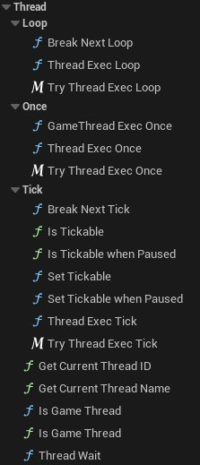

选择其中的Create Thread Exec Tick节点。

简单的使用案例如下。在该示例图中，除了Create Thread Exec Tick节点的节点都是演示用的节点，并不是本插件含有的节点。MainProcess1为前处理，MainProcess2为执行了该节点之后的后处理。DoAlgorithm即其他线程中执行的任务。CallBack是Loop跳出后执行的回调任务。

该使用案例将创建一个每次Tick执行一次算法函数的线程任务。算法函数返回一个是否完成的布尔值，用来判断是否打断循环tick、关闭线程并执行Completed。

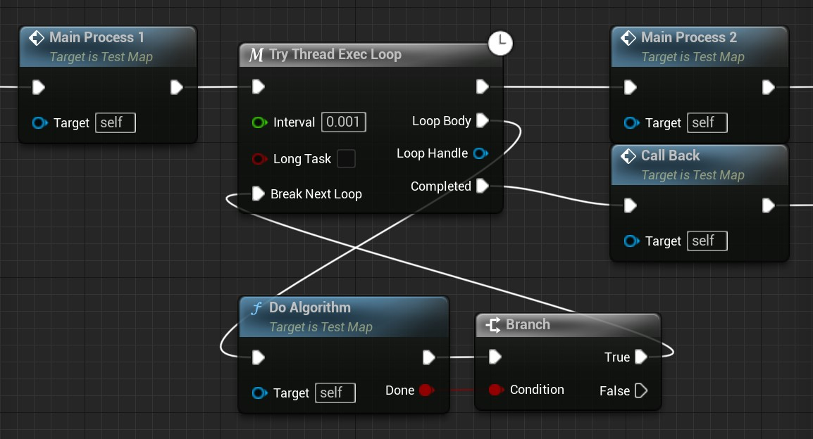

## 前置知识

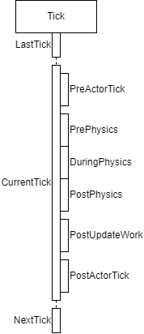

上图是一个Tick内执行的主要内容的简化图。执行顺序从上到下。第一层结构是主要tick，向下一级是Tick内部不同的Tick组。这些Tick组将会串行执行。另外，这个主tick线是发生在游戏线程中的。

上图为在一个tick内，有多个部分tick先后执行。其中有关游戏逻辑的部分大多放在了PrePhysics到PostUpdateWork之间。

在各个Tick之间，有时UE也会进行垃圾回收（GC）。所以将重要的对游戏对象的操作放在除了允许计算游戏逻辑的tick组之外的地方执行往往会导致崩溃。

以下节点将会提供安全的在其他线程中执行游戏逻辑，但是其实现的方式也是基于与主Tick同步的方式。

## 节点目录

------

## CreateThreadExecOnce

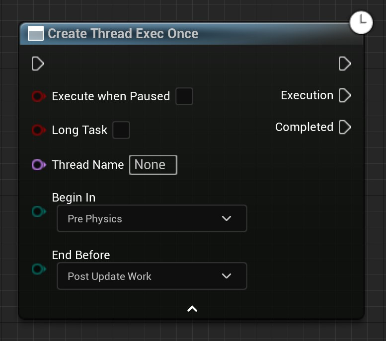

- 该节点用于创建一个线程并执行一次任务。
- 可在任何地方使用。（下同）
- 创建的线程的生命周期取决于线程的执行全过程和外部的Object。如果当线程处于执行状态时，外部的Object被销毁，则会导致线程立刻停止执行且Completed不会被执行。（下同）

| 节点引脚          | 描述                                                         |
| ----------------- | ------------------------------------------------------------ |
| 默认执行输入      | 执行该引脚后会创建线程并执行（下同）                         |
| bLongTask         | 如果为真，则创建单独的线程。独立线程一般用于执行长任务。如果为假，则创建线程任务。其一般用于执行短任务。创建短任务线程时的性能消耗是最少的。（下同） |
| ExecuteWhenPaused | 当游戏暂停时是否仍然继续执行                                 |
| ThreadName        | 自定义线程名称，如果未None，则为Pair默认值                   |
| TimingPair        | 决定在一帧内执行时合适开始、合适结束的时机对                 |
| 默认执行输出      | 创建线程后执行该引脚（下同）                                 |
| Execution         | 线程创建后将执行一次该引脚                                   |
| Completed         | Execution执行完成后，将会在游戏主线程中执行该引脚            |

- 执行解释

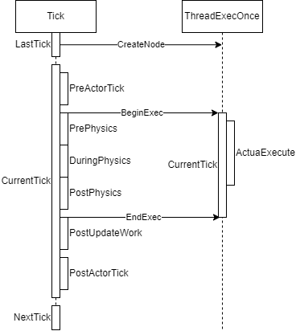

上图为CreateThreadExecOnce的执行时机。

你执行了该节点时，会先创建一个执行对象，但此时（LastTick）并不会立即执行任务。而是等待到下一次tick。到下一tick时（CurrentTick），会根据你在创建该线程任务时传入的参数（BeginIn、EndBefore）来控制任务的开始执行和确保结束。如图，根据传入的执行时机参数，我们在tick执行到PrePhysics时开始执行任务。于是在另一个线程里的任务就被触发开始执行了。

等执行到PostUpdateWork时，因为我们的EndBefore传入的参数是PostUpdateWork。所以这里会询问线程任务：是否执行完毕。如果执行完毕，则询问操作立即结束，紧接着tick继续执行。如果执行为完毕，则会等待，直到线程任务执行完毕，再返回，然后tick继续执行。

从上面可以看出有几个注意的点！

- Once执行节点的任务执行部分不要委托过多的任务，否则可能会导致下一tick的任务等待被延长，从而导致下一tick卡顿。
- TimingPair里的BeginIn、EndBefore要谨慎选择。BeginIn是任务开始的时机，执行后线程任务会立即开始。EndBefore是等待线程执行结束。这两个的可选值可以选的很广，如BeginIn选PreActorTick，EndBefore选PostActorTick。但是注意！安全的执行时机一般在PrePhysics到PostUpdateWork之间。更广的执行时机只是插件提供的特殊选择。仅用于特别的需求。但是更广的执行时机并不能保证程序正常稳定地运行。如果这导致了你的程序的崩溃，请缩短执行时机。
- 可以看出我们交给线程执行节点的任务会在另一个线程中被执行，但这并不一定能满足你的需求。原因是有些函数的执行会要求仅在游戏线程内执行，所以将这类节点交给线程节点去执行很可能会导致崩溃。这一次我不能做出任何的保证，因为这和被执行函数的编写者（或许是EpicGames）有关。

### 蓝图宏

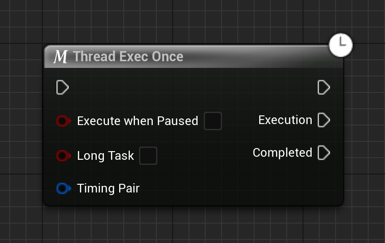

该宏节点是CreateThreadExecOnce的简化版。该节点确保不会被重复执行。即，当该节点执行一次后，会创建一个线程任务到下一个tick，直到创建的线程任务执行完毕之前，重复执行该节点将不做任何事。下同

------

## CreateGameThreadExecOnce

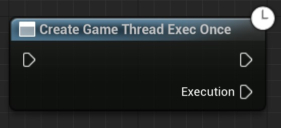

- 这个节点用于在游戏主线程中执行。一般用于在其他线程中通过该节点让游戏线程执行一些函数。例如：在其他线程中通过该节点在游戏主线程中执行 打印字符串 函数。
- 一些依赖游戏线程的函数（如：打印字符串）最好在游戏线程中执行。如果你的运行出了错误或者崩溃，请尝试移动这些函数到游戏线程中执行。

| 节点引脚       | 描述                                 |
| -------------- | ------------------------------------ |
| GameThreadExec | 传入一个你想要在游戏线程中执行的委托 |

------

## CreateThreadExecTick

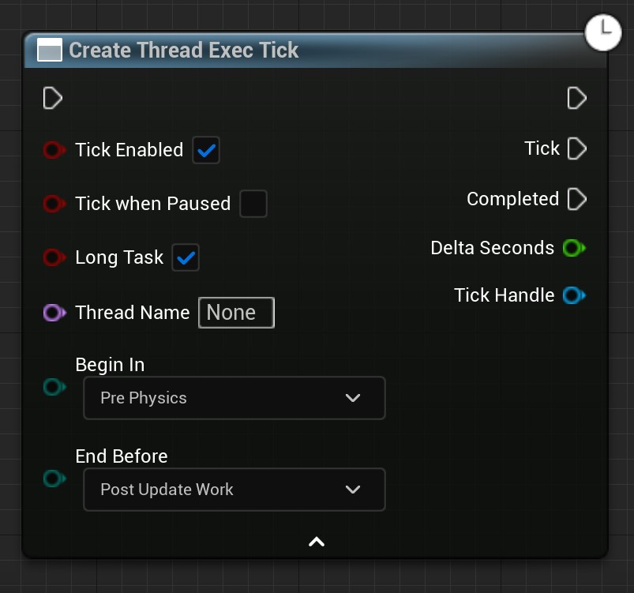

- 该节点用于在其他线程中当每一Tick开始时执行一次。这是一种特殊的循环，它只会在每一Tick执行一次。当当前的Tick任务提前完成时，且尚未进入下一个Tick，则该线程会等待。直到进入下一个Tick后再执行一次Tick引脚

| 节点引脚       | 描述                                                         |
| -------------- | ------------------------------------------------------------ |
| TickEnabled    | 是否默认执行Tick，如果为true，创建线程后执行Tick。如果为false，则创建线程后不会执行Tick，直到该值为真。 |
| TcikWhenPaused | 是否在游戏暂停时执行Tick                                     |
| bLongTask      | 如果为真，则创建单独的线程。独立线程一般用于执行长任务。如果为假，则创建线程任务。其一般用于执行短任务。创建短任务线程时的性能消耗是最少的。（下同） |
| ThreadName     | 自定义线程名称，如果未None，则为默认值                       |
| TimingPair     | 决定在一阵内执行时合适开始、合适结束的时机对                 |
| Behavior       | Tick行为结构体。用于在执行时决定Tick的静动态执行次数。       |
| Execution      | 每一Tick执行的引脚                                           |
| TickEnd        | 在一次全部的Execution结束后，会执行的引脚                    |
| Completed      | Tick跳出时执行的引脚                                         |
| DeltaSeconds   | Tick引脚附带的参数。表示当前Tick的变化时间。                 |
| TickHandle     | TickHandle是这个线程Tick的对象引用。用于对该线程Tick进行控制。 |

- 执行解释

执行时机其实和CreateThreadExecOnce差不多。只不过在执行完毕后会在下一tick继续重复操作。

### 辅助函数

| 名称                  | 图示                                                         | 描述                                                         |
| --------------------- | ------------------------------------------------------------ | ------------------------------------------------------------ |
| BreakNextTick         | 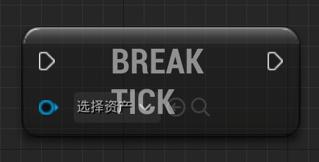 | 打断下一次Tick并跳出。                                       |
| IsTicking             | 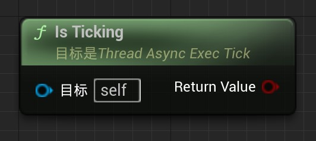 | 是否正在执行任务                                             |
| IsTickEnabled         | 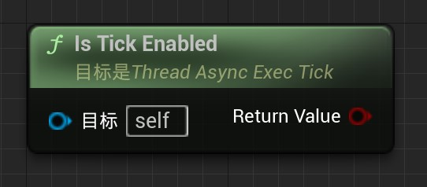 | 获取线程Tick的可否Tick值。                                   |
| SetTickEnabled        | 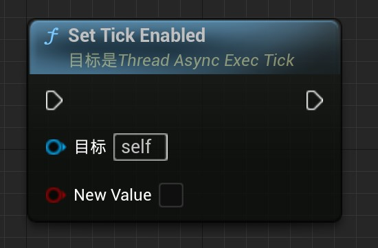 | 设置线程Tick可否Tick值。设置为真后将使其能执行Tick。设置为假后将使其不能被Tick。该值的真假并不影响该线程Tick的生命周期。 |
| IsTickableWhenPaused  | 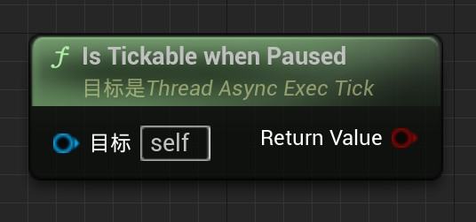 | 获取线程Tick的可否在游戏暂停时Tick的值。                     |
| SetTickableWhenPaused | 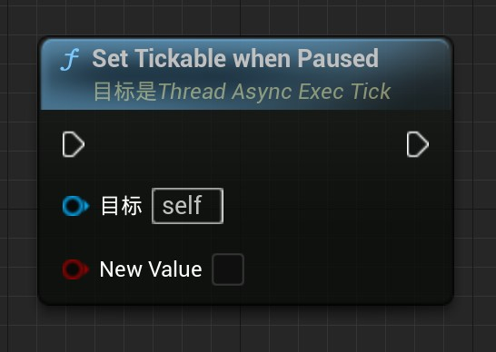 | 设置线程Tick的可否在游戏暂停时Tick的值。                     |
| GetTimingPair         | 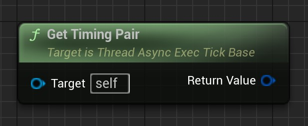 | 获取线程Tick的时机对                                         |
| GetBehavior           | 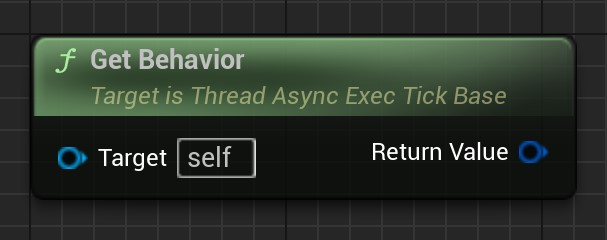 | 获取线程Tick的行为定义                                       |

### 蓝图宏

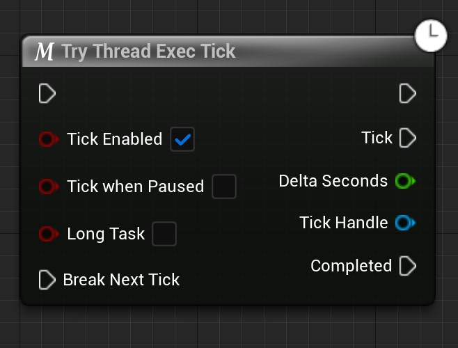

- 这是一个对CreateThreadExecTick包装的宏. 包装的目的和Thread Exec Once相同。

------

## CreateThreadExecTickForLoop

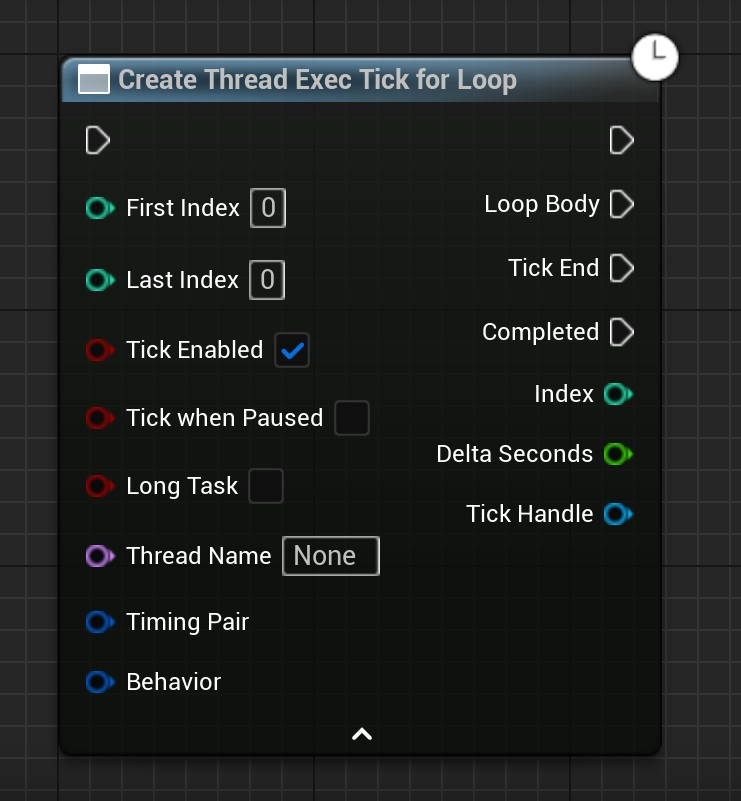

- 该节点功能是CreateThreadExecTick的拓展。它的执行Tick次数是有限的。它会从下标FirstIndex依次执行到LastIndex（包含LastIndex）

下面仅解释与CreateThreadExecTick不同的引脚

| 节点引脚   | 描述                       |
| ---------- | -------------------------- |
| FirstIndex | 循环时的第一个循环的下标   |
| LastIndex  | 循环时的最后一个循环的下标 |
| Index      | 当前循环的下标             |

### 辅助函数

| 名称          | 图示                                                         | 描述                   |
| ------------- | ------------------------------------------------------------ | ---------------------- |
| GetCurrent    | 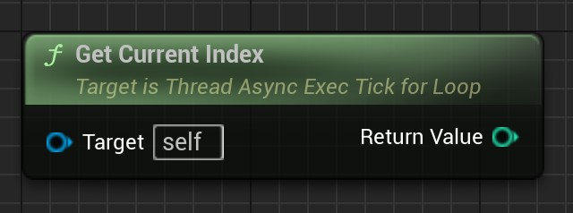 | 获取线程Loop的当前下标 |
| GetFirstIndex | 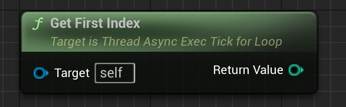 | 获取线程Loop的开始下标 |
| GetLastIndex  | 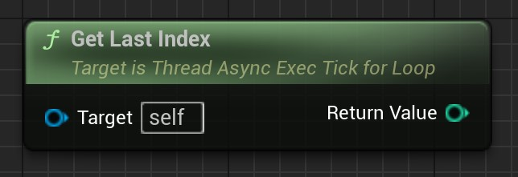 | 获取线程Loop的结束下标 |

### 蓝图宏

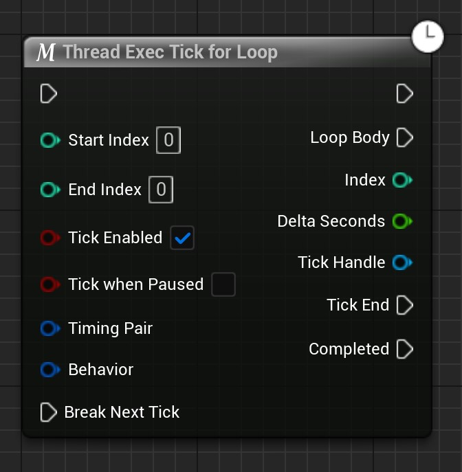

- 这是一个对CreateThreadExecTickForLoop包装的宏. 包装的目的和CreateThreadExecOnce相同。

------

## ThreadExecTickForeach

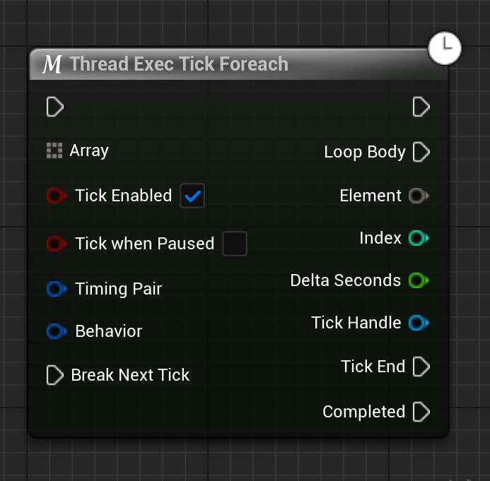

- 该节点不用多说。是根据一个数组的元素进行遍历。默认遍历行为是每一次Tick遍历一个元素。通过Behavior结构体参数可以使用其他遍历行为

------

## Unsafely Thread Execution Nodes

### ThreadExecOnceUnsafely

不安全地执行一次。这个节点开发不完善，且有很多问题。注意使用！

它并没有上述的Once节点那样有跟游戏线程Tick同步的机制，所以他会无视掉这些直接强制执行线程任务。

如果你将一些游戏逻辑放进去，很可能会导致崩溃。

不建议使用。

### ThreadExecLoopUnsafely

同上，不建议使用。

### ThreadExecTickUnsafely

同上，不建议使用。

------

## 工具

### 工具集

| 名称                 | 图示                                                         | 描述                                                 |
| -------------------- | ------------------------------------------------------------ | ---------------------------------------------------- |
| GetCurrentThreadID   | 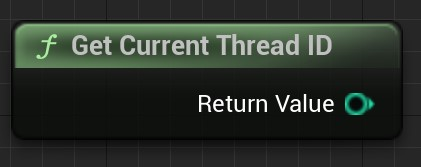 | 获取执行该节点的线程ID                               |
| GetCurrentThreadName | 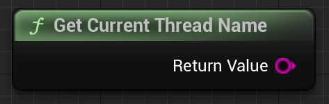 | 获取执行该节点的线程名称                             |
| SetThreadName        | 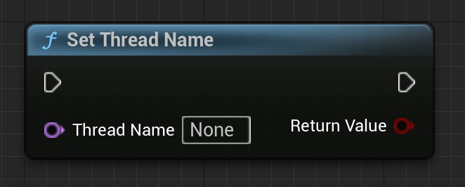 | 设置当前线程的名称                                   |
| IsGameThread         | 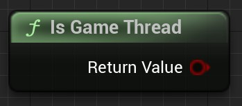 | 获取执行该节点的线程是否为游戏线程                   |
| IsGameThread         | 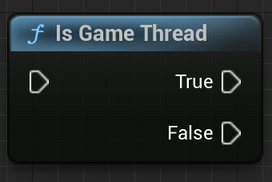 | 一个分支选项。条件是执行该节点的线程是否是游戏线程。 |

------

### 子系统

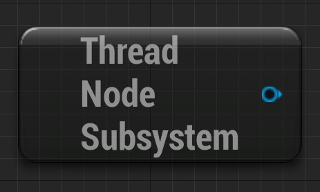

- 该子系统旨在提供线程节点的全局信息，现版本仅提供获取所有的线程节点的功能。
- **当前功能暂时不提供支持和更新。其他功能优先更新**

#### 函数

| 名称                      | 图示                                                         | 描述                                                         |
| ------------------------- | ------------------------------------------------------------ | ------------------------------------------------------------ |
| Get All Thread Exec Nodes | 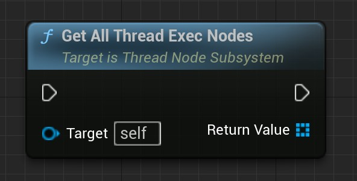 | 获取所有的线程执行节点，返回一个元素类型为ThreadAsyncExecBase引用的数组。目前版本该类型的引用没有什么可以调用的函数。 |
| Get All Thread Exec Onces | 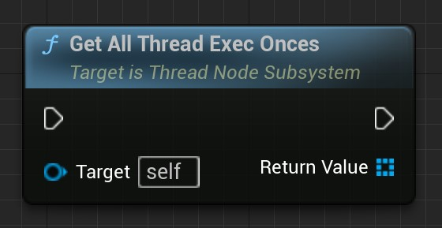 | 获取所有的线程执行一次节点，返回一个元素类型为ThreadAsyncExecOnce引用的数组。 |
| Get All Thread Exec Ticks | 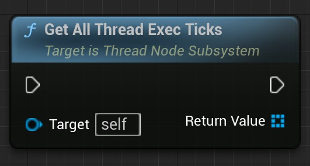 | 获取所有的线程执行一次节点，返回一个元素类型为ThreadAsyncExecTick引用的数组。 |

------

## 类型

### EThreadTickTiming

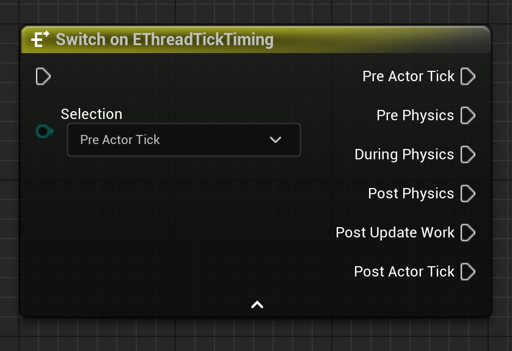

- 该Tick时机戳枚举用于表示在一次Tick内的不同时间。

| 枚举值         | 解释                        |
| -------------- | --------------------------- |
| PreActorTick   | 在所有Actor进行tick之前     |
| PrePhysics     | 在进行物理模拟之前          |
| DuringPhysics  | 在进行物理模拟时            |
| PostPhysics    | 在进行物理模拟之后          |
| PostUpdateWork | 在Tick完毕之前              |
| PostActorTick  | 在所有Actor进行Tick完毕之后 |

------

### FThreadExecTimingPair

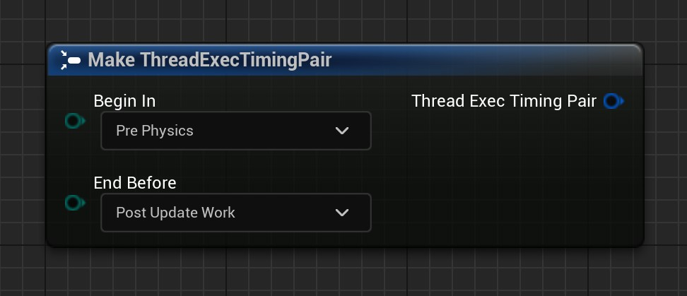

- 该结构体包含两个tick时机戳

| 成员名    | 类型              | 解释         |
| --------- | ----------------- | ------------ |
| BeginIn   | EThreadTickTiming | 开始于……     |
| EndBefore | EThreadTickTiming | 在……之前结束 |

------

### FThreadTickExecBehavior

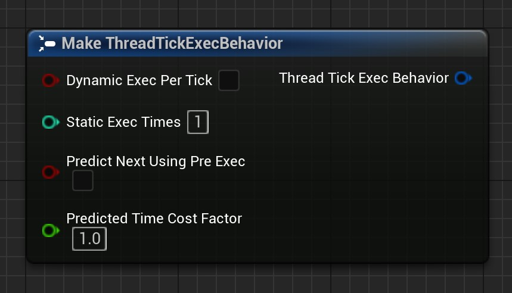

- 该结构体用于描述Tick执行时的行为。默认值将使线程Tick每帧执行一次。

| 成员名                  | 类型  | 解释                                                         |
| ----------------------- | ----- | ------------------------------------------------------------ |
| bDynamicExecPerTick     | bool  | 是否启用动态的每帧执行次数。如果启用，则每帧会执行多次，具体次数取决于可用耗时。会在线程Tick开始时持续重复执行，直到线程Tick结束时。 |
| StaticExecTimes         | int32 | bDynamicExecPerTick为false时有效。静态执行时固定的每帧执行次数。 |
| PredictNextUsingPreExec | bool  | bDynamicExecPerTick为true时有效。当执行一次时，是否要根据上次执行的耗时以及当前剩余可用耗时来预测是否要继续重复执行。 |
| PredictedTimeCostFactor | float | bDynamicExecPerTick和PredictNextUsingPreExec均为true时有效。该值作为上次执行耗时的系数。值为1时，意味着将上次执行的时间作为参考，来预测剩余耗时是否能够允许再次一次。该值大于1时，将导致动态执行在一次tick内提前结束。该值小于1时，可能导致动态执行可能会稍微阻塞一下游戏线程，造成游戏线程闲置。 |

