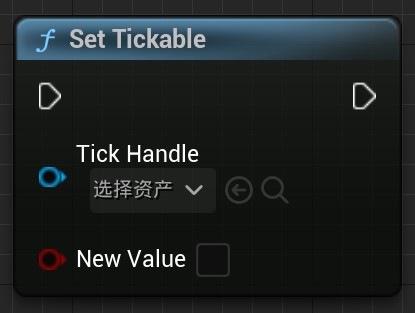
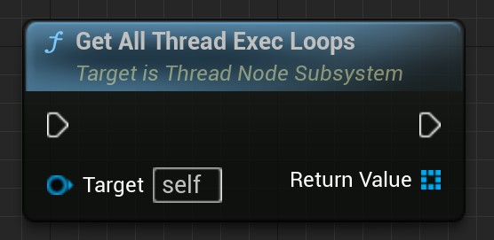

# 线程执行蓝图节点 v0.9

- 版本0.9相比版本0.8的改动项：

  - 暂时将Thread Exec Loop相关的节点置为废弃
  
  - 改进了异步执行节点的稳定性。目前所有的异步节点的执行时机和Actor的Tick间隙保持一致。即异步执行不会在Actor的Tick之外的时间执行。这保证了通过异步执行节点去执行有关Actor的操作时一般不会产生报错（注：在执行其他部分函数时仍可能产生报错，但稳定性已有提升）

## 插件简介

多线程编程用于执行那些导致主线程（即游戏线程）阻塞的计算任务，将这些任务放到其他线程中执行并不会阻塞主线程。从而解决了在游戏中计算高负载任务导致的阻塞问题。

本插件提供了多个蓝图节点用于快速的创建并执行多线程任务，使用简单，性能消耗小。

## 快速使用

在事件图表中右键搜索Thread关键字找到该分类

选择其中的Try Thread Exec Once节点。

简单的使用案例如下。除了Try Thread Exec Once节点的节点都是演示用的节点，并不是本插件含有的节点。MainProcess1为前处理，MainProcess2为执行了该节点之后的后处理。DoAlgorithm即其他线程中执行的任务。CallBack是Loop跳出后执行的回调任务。

## 节点目录

## ThreadExecOnce

### 主要节点

- 该节点用于创建一个线程并执行一次任务。
- 可在任何地方使用。（下同）
- 创建的线程的生命周期取决于线程的执行全过程和外部的Object。如果当线程处于执行状态时，外部的Object被销毁，则会导致线程立刻停止执行且Completed不会被执行。（下同）

| 节点引脚     | 描述                                                         |
| ------------ | ------------------------------------------------------------ |
| 默认执行输入 | 执行该引脚后会创建线程并执行（下同）                         |
| bLongTask    | 如果为真，则创建单独的线程。独立线程一般用于执行长任务。如果为假，则创建线程任务。其一般用于执行短任务。创建短任务线程时的性能消耗是最少的。（下同） |
| 默认执行输出 | 创建线程后执行该引脚（下同）                                 |
| Execution    | 线程创建后将执行一次该引脚                                   |
| Completed    | Execution执行完成后，将会在游戏主线程中执行该引脚            |

------

- 这个节点用于在游戏主线程中执行。一般用于在其他线程中通过该节点让游戏线程执行一些函数。例如：在其他线程中通过该节点在游戏主线程中执行 打印字符串 函数。
- 一些依赖游戏线程的函数（如：打印字符串）最好在游戏线程中执行。如果你的运行出了错误或者崩溃，请尝试移动这些函数到游戏线程中执行。

| 节点引脚  | 描述                   |
| --------- | ---------------------- |
| Execution | 在游戏线程中执行该引脚 |

------

### 蓝图宏

- 这个宏对ThreadExecOnce进行了封装。基本的功能和原本的一致。不同之处在于：当原本的线程任务正在执行时再一次执行了该节点并不会创建新的线程任务，而是直接无视，只有当原先的线程任务执行完成后此节点可再次使用。

## ThreadExecLoop(v0.9已废弃)

### 主要节点

- 该节点用于线程循环执行。当执行该节点后，该节点会创建一个线程，并执行一个循环任务。如果你需要线程循环执行，请不要通过ThreadExecOnce节点+WhileLoop节点实现。因为蓝图有一次最多执行次数限制，这么做会导致循环执行一定次数后被迫停止。所以请使用本节点。

| 节点引脚   | 描述                                                         |
| ---------- | ------------------------------------------------------------ |
| Interval   | 每一次Loop之间的线程等待时间。这么做是为了防止线程阻塞，暂时没发现如果其值为0时产生的问题。 |
| LoopBody   | 每一次Loop时执行的引脚                                       |
| Completed  | 循环体被Break跳出后在游戏线程中执行的引脚                    |
| LoopHandle | LoopHandle是这个线程循环的对象引用。用于通过该引用对该线程循环进行控制，如跳出循环 |

------

### 辅助函数

- 这个节点用于打破线程循环。如果循环在执行中，将在下次循环执行前跳出。

例子：

- 在该例中，执行顺序如上。二号引脚将会在创建线程任务后在游戏线程中执行。创建的线程将会循环执行引脚3。在第一个循环中执行了BreakLoop节点，这将使得目标循环（也就是该循环）在下一次循环执行前跳出。之后执行4号节点后面的函数。执行完全后，进入第二次循环。因为已经被打断，所以跳出并在游戏线程中执行5号引脚。

### 蓝图宏

- 这是一个对ThreadExecLoop包装的宏。包装的目的和Try Thread Exec Once相同。

## ThreadExecTick

### 主要节点

- 该节点用于在其他线程中当每一Tick开始时执行一次。这是一种特殊的循环，它只会在每一Tick执行一次。当当前的Tick任务提前完成时，且尚未进入下一个Tick，则该线程会等待。直到进入下一个Tick后再执行一次Tick引脚

| 节点引脚                   | 描述                                                         |
| -------------------------- | ------------------------------------------------------------ |
| TickEnabled(v0.9已废弃)    | 是否默认执行Tick，如果为true，创建线程后执行Tick。如果为false，则创建线程后不会执行Tick，直到该值为真。 |
| TcikWhenPaused(v0.9已废弃) | 是否在游戏暂停时执行Tick                                     |
| Tick                       | 每一Tick执行的引脚                                           |
| Completed                  | Tick跳出时执行的引脚                                         |
| DeltaSeconds               | Tick引脚附带的参数。表示当前Tick的变化时间。                 |
| TickHandle                 | TickHandle是这个线程Tick的对象引用。用于对该线程Tick进行控制。 |

### 辅助函数

| 名称                              | 图示                                                         | 描述                                                         |
| --------------------------------- | ------------------------------------------------------------ | ------------------------------------------------------------ |
| BreakNextTick                     |  | 打断下一次Tick并跳出。                                       |
| IsTickable(v0.9已废弃)            |  | 获取线程Tick的可否Tick值。                                   |
| SetTickable(v0.9已废弃)           |  | 设置线程Tick可否Tick值。设置为真后将使其能执行Tick。设置为假后将使其不能被Tick。该值的真假并不影响该线程Tick的生命周期。 |
| IsTickableWhenPaused(v0.9已废弃)  |  | 获取线程Tick的可否在游戏暂停时Tick的值。                     |
| SetTickableWhenPaused(v0.9已废弃) |  | 设置线程Tick的可否在游戏暂停时Tick的值。                     |

### 蓝图宏

- 这是一个对ThreadExecTick包装的宏. 包装的目的和Try Thread Exec Once相同。

## 工具

### 工具集

| 名称                   | 图示                                                         | 描述                                                         |
| ---------------------- | ------------------------------------------------------------ | ------------------------------------------------------------ |
| GetCurrentThreadID     |  | 获取执行该节点的线程ID                                       |
| GetCurrentThreadName   |  | 获取执行该节点的线程名称                                     |
| IsGameThread           |  | 获取执行该节点的线程是否为游戏线程                           |
| IsGameThread           |  | 一个分支选项。条件是执行该节点的线程是否是游戏线程。         |
| ThreadWait(v0.9已废弃) |  | 线程等待，只能用于非游戏线程。一般用于让线程停止运行等待一定时间后再运行。如果该节点被执行于游戏线程中，将不会产生任何效果，会直接跳过。 |

------

### 子系统

该子系统旨在提供线程节点的全局信息，现版本仅提供获取所有的线程节点的功能。

- 可调用的函数

| 名称                                  | 图示                                                         | 描述                                                         |
| ------------------------------------- | ------------------------------------------------------------ | ------------------------------------------------------------ |
| Get All Thread Exec Nodes             |  | 获取所有的线程执行节点，返回一个元素类型为ThreadAsyncExecBase引用的数组。目前版本该类型的引用没有什么可以调用的函数。 |
| Get All Thread Exec Onces             |  | 获取所有的线程执行一次节点，返回一个元素类型为ThreadAsyncExecOnce引用的数组。 |
| Get All Thread Exec Loops(v0.9已废弃) |  | 获取所有的线程执行一次节点，返回一个元素类型为ThreadAsyncExecLoop引用的数组。 |
| Get All Thread Exec Ticks             |  | 获取所有的线程执行一次节点，返回一个元素类型为ThreadAsyncExecTick引用的数组。 |

