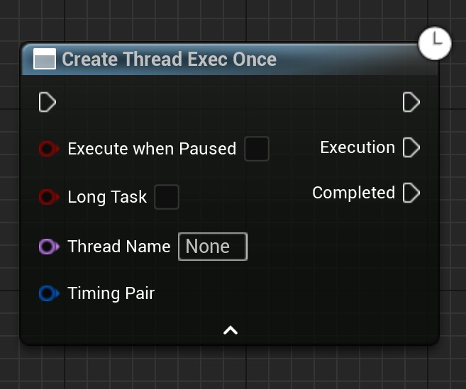
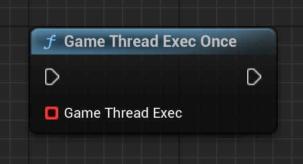
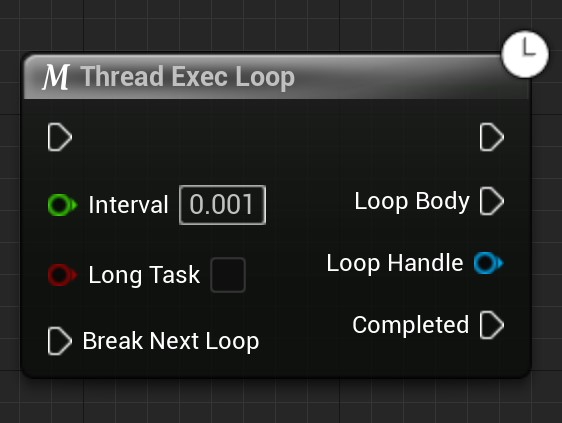
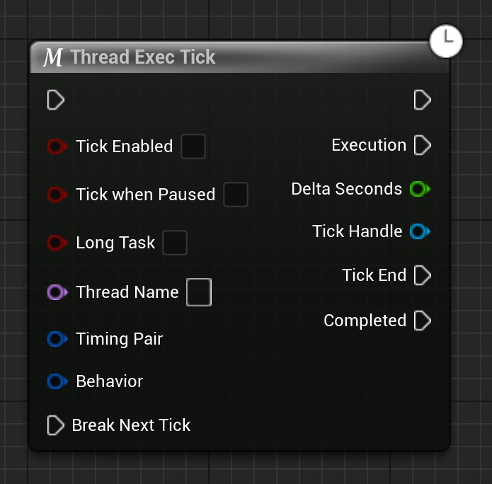

# ThreadExecutionBlueprintNode

## ThreadExecOnce

### 主要节点

- 该节点用于创建一个线程并执行一次任务。
- 可在任何地方使用。（下同）
- 创建的线程的生命周期取决于线程的执行全过程和外部的Object。如果当线程处于执行状态时，外部的Object被销毁，则会导致线程立刻停止执行且Completed不会被执行。（下同）

| 节点引脚     | 描述                                                         |
| ------------ | ------------------------------------------------------------ |
| 默认执行输入 | 执行该引脚后会创建线程并执行（下同）                         |
| bLongTask    | 如果为真，则创建单独的线程。独立线程一般用于执行长任务。如果为假，则创建线程任务。其一般用于执行短任务。创建短任务线程时的性能消耗是最少的。（下同） |
| 默认执行输出 | 创建线程后执行该引脚（下同）                                 |
| Execution    | 线程创建后将执行一次该引脚                                   |
| Completed    | Execution执行完成后，将会在游戏主线程中执行该引脚            |

------

- 这个节点用于在游戏主线程中执行。一般用于在其他线程中通过该节点让游戏线程执行一些函数。例如：在其他线程中通过该节点在游戏主线程中执行 打印字符串 函数。
- 一些依赖游戏线程的函数（如：打印字符串）最好在游戏线程中执行。如果你的运行出了错误或者崩溃，请尝试移动这些函数到游戏线程中执行。

| 节点引脚  | 描述                   |
| --------- | ---------------------- |
| Execution | 在游戏线程中执行该引脚 |

------

### 蓝图宏

- This is a macro that wraps ThreadExecOnce. The basic function is the same as it. The difference is that when this has already been executed once and the thread task is running, executing the node again will be blocked so that no new thread task is created. It can only be executed again when the original thread task is completed.
- 这个宏对ThreadExecOnce进行了封装。基本的功能和原本的一致。不同之处在于：当原本的线程任务正在执行时再一次执行了该节点并不会创建新的线程任务，而是直接无视，只有当原先的线程任务执行完成后此节点使用。

## ThreadExecLoop

### 主要节点

- This node is used to loop through other threads for execution. If you need loop execution, do not use the ThreadExecOnce node plus WhileLoop to achieve it. Doing so is not possible because the blueprint has a limit on the number of one-time node executions.

| Node Pins  | Description                                                  |
| ---------- | ------------------------------------------------------------ |
| Interval   | The wait time between the previous loop and the next loop. This is used to prevent threads from blocking. No problems caused when this value is 0 have been found so far |
| LoopBody   | The loop body that will be executed for each loop            |
| Completed  | Pins that are executed after the loop body breaks            |
| LoopHandle | LoopHandle is the handle to this loop. This handle allows you to control the execution of the loop |

------

### 辅助函数

- This function is used to break a loop. If the loop is executing, it will jump out of the loop before executing the next one

Example.

- In the example, the order of execution is as above. Number two will perform the rest of the tasks in the game thread. The created thread will loop to execute pin 3. The first loop in the figure then calls the function that break the loop and continues executing the rest of the node until the end. On the second execution of the loop body because it was broken, the loop is jumped out and Completed is executed.

### 蓝图宏

- This is a macro that wraps ThreadExecLoop. The purpose of its wrapping is the same as ThreadExecOnce.

## ThreadExecTick

### 主要节点

- This node is used in other threads to execute once with each Tick of the game. This is a special kind of loop whose loop body is executed at each Tick. When the task ends early it does not go directly to the next loop, but waits for the next Tick to initiate execution.

| Node Pins      | Description                                                  |
| -------------- | ------------------------------------------------------------ |
| TickEnabled    | The value of TickEnabled at the beginning of the Tick thread. If it is true, the Tick is executed immediately after the node; if it is false, the Tick is not executed until the end or the value of its TickEnabled is true. |
| TcikWhenPaused | Whether to execute Tick when the game is paused              |
| Tick           | Pins executed at each tick                                   |
| Completed      | Pin executed when Tick execution jumps out                   |
| DeltaSecond    | Parameters for Tick pin execution. is the delta time of the current Tick |
| TickHandle     | TickHandle is the handle to this tick. This handle allows you to control the execution of the tick |

### 辅助函数

| Name                  | Graph                                                        | Description                                                  |
| --------------------- | ------------------------------------------------------------ | ------------------------------------------------------------ |
| BreakNextTick         |  | Break the execution of the next Tick and jump out            |
| IsTickable            |  | Get the Tickable value of a Tick thread                      |
| SetTickable           |  | Sets the Tickable value of a Tick thread. If set to true, the Tick is executed. if set to false, the Tick is not executed and does not jump out. Can be reset to true in the future to continue executing Tick |
| IsTickableWhenPaused  |  | Get the TickableWhenPaused value of a Tick thread            |
| SetTickableWhenPaused |  | Set the value of whether the Tick can be executed when the game is paused |

### 蓝图宏

- This is a macro that wraps ThreadExecTick. The purpose of its wrapping is the same as ThreadExecOnce.

## 工具

| Name                 | Graph                                                        | Description                                                  |
| -------------------- | ------------------------------------------------------------ | ------------------------------------------------------------ |
| GetCurrentThreadID   |  | Get the thread ID of the thread executing the node           |
| GetCurrentThreadName |  | Get the name of the thread executing the node                |
| IsGameThread         |  | Gets the value of whether the thread executing the node is a game thread |
| IsGameThread         |  | A branching option. The condition is whether the thread executing the node is a game thread |
| ThreadWait           |  | Thread waiting. Can only be used for non-game threads. Used to wait for a certain amount of time in other threads. If the node is executed in the game thread it will not make the game thread wait. |

