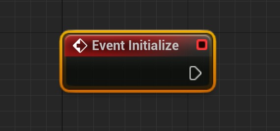

# BlueprintableSubsystem v1.4

- Partially translated by lpl

## The Profile of Plugin

This plugin provides six subsystems that can be inherited from blueprints：

- BPable_GameInstanceSubsystem

- BPable_LocalPlayerSubsystem

- BPable_WorldSubsystem

- BPable_TickableGameInstanceSubsystem

- BPable_TickableLocalPlayerSubsystem

- BPable_TickableWorldSubsystem

> This usage of the Get to BPable subsystem in the figure is **illegal**. Because these Subsystems in the figure are the base classes provided by the plugin, they should not be acquired under any circumstances.
>
> Of course, it is OK to get your subsystem blueprint class in the way in the figure.
>
> About the use of the plugin is below. The above diagram only shows the role

Users can obtain the blueprint subsystem by inheriting these base classes directly from the blueprint.

## Step-by-step usage guide

> Take BPable_GameInstanceSubsystem as an example

- Open the project's plugin Settings

  

- Ensure that the BlueprintableSubsystem plugin is enabled

  

- Create the blueprint class in the Content browser and select BPable_GameInstanceSubsystem as the parent class

  

- Or you can quickly create subsystems in the content browser by right-clicking > Blueprints > Subsystems

  

- Then open the blueprint class of the GameInstanceSubsystem you created and edit it

  

- Call the blueprint Subsystem you created using the Get Subsystem general node in other blueprint classes

  

  

## About BlueprintableSubsystem

###  General Usage

In my Blueprint on the left side of the Blueprint class edit window click to override the corresponding function

Do not use a node whose World must be known in advance (such as GetActorOfClass and Delay) in Event Initialize and  Deinitialize.

​	Reason: Subsystem's event Initialize and event Deinitialize are executed when World is not ready or is uninstalled, so executing nodes such as GetActorOfClass or Delay is not effective at this time.

​	Suggestion: Use this type of node for events other than event Initialize and event Deinitialize, such as WorldBeginPlay, Tick, or custom events

### BPable_GameInstanceSubsystem

- Life time

  Follow its' Outer,which is also called UGameInstance.

- Events

  | Name                  | Graphic                                                      | Explain                                                      |
  | --------------------- | ------------------------------------------------------------ | ------------------------------------------------------------ |
  | Initialize            |  | A event called after this subsystem created                  |
  | WorldBeginPlay        |  | 此World开始执行BeginPlay时调用的事件                         |
  | WorldBeginTearDown    |  | 此World开始执行TearDown时调用的事件                          |
  | Deinitialize          |  | A event called before this subsystem was destoryed           |
  | ShouldCreateSubsystem |  | A function called before this subsystem created  the Implementation of it is not necessary If implement this function,return true to create this subsystem,return false not to create this subsystem |

- Functions

  | Name            | Graphic                                                      | Explain                                                      |
  | --------------- | ------------------------------------------------------------ | ------------------------------------------------------------ |
  | GetGameInstance |  | Get the Outer, or UGameInstance, of the game instance subsystem |

  

---

### BPable_LocalPlayerSubsystem

- Life time

  Follow its' Outer,which is also called ULocalPlayer.

- Events

  | Name                  | Graphic                                                      | Explain                                                      |
  | --------------------- | ------------------------------------------------------------ | ------------------------------------------------------------ |
  | Initialize            |  | A event called after this subsystem created                  |
  | WorldBeginPlay        |  | 此World开始执行BeginPlay时调用的事件                         |
  | WorldBeginTearDown    |  | 此World开始执行TearDown时调用的事件                          |
  | Deinitialize          |  | A event called before this subsystem was destoryed           |
  | ShouldCreateSubsystem |  | A function called before this subsystem created  the Implementation of it is not necessary If implement this function,return true to create this subsystem,return false not to create this subsystem |

- Functions

  | Name                     | Graphic                                                      | Explain                                                      |
  | ------------------------ | ------------------------------------------------------------ | ------------------------------------------------------------ |
  | GetLocalPlayerController |  | Get the APlayerController Corresponding to ULocalPlayer from the Outer(ULocalPlayer) of local player's sub system ,  return null when implementing Initialize |

---

### BPable_WorldSubsystem

- Life time

  Following its' Outer，which is also called UWorld.Only appear in Game or PIE.

- Events

  | Name                  | Graphic                                                      | Explain                                                      |
  | --------------------- | ------------------------------------------------------------ | ------------------------------------------------------------ |
  | Initialize            |  | A event called after this subsystem created                  |
  | PostInitialize        |  | A event called after all UWorldSubsystem calls Initialize    |
  | WorldBeginPlay        |  | A event called when world is ready to start gameplay before the game mode transitions to the correct state and call BeginPlay on all actors |
  | Deinitialize          |  | A event called before this subsystem was destoryed           |
  | ShouldCreateSubsystem |  | A function called before this subsystem created  the Implementation of it is not necessary If implement this function,return true to create this subsystem,return false not to create this subsystem |

------

## General Functions

### Subsystem blueprint class with active state

- Function Overview

  An independent activation state that does not materially affect the Subsystem itself, providing a boolean state to the user

- Applicable Base Classes

  Subclasses of a base class whose class name is prefixed with "BPable"

- Class defaults

  | Name          | Explain                   |
  | ------------- | ------------------------- |
  | ActiveDefault | Default activation status |

- Functions

  | Name         | Graphic                                                      | Explain                                                      |
  | ------------ | ------------------------------------------------------------ | ------------------------------------------------------------ |
  | IsActive     |  | Get the activation status value                              |
  | Activate     |  | Activate and broadcast activation When the parameter bReset is true, it will still be activated again even if it is already active. |
  | Deactivate   |  | Deactivate                                                   |
  | ToggleActive |  | Toggle activation                                            |
  | SetActive    |  | Sets the activation status.  The parameter NewActive is the new value to be set. The parameter Reset is whether to reset the activation |

- Delegates

  | 名称                      | 解释                                                         |
  | ------------------------- | ------------------------------------------------------------ |
  | OnActivated(Object,Reset) | The delegate executed after activation  The parameter Object is a reference to the Subsystem that distributes the delegate  The parameter Reset is whether the activation is reset on activation |
  | OnDeactivated(Object)     | The delegate executed after the inactivation  parameter Object is a reference to the Subsystem that distributes the delegate |

---

### Tickable subsystem blueprint classes

- Function Overview

  With this feature subsystem blueprint classes can execute Tick events with each frame

  Tick events receive the effect of the activation status. Even if Tick is currently available, if it is not activated, the Tick event is not executed.

- Applicable Base Classes

  Subclasses of a base class whose class name is prefixed with "BPable_Tickable"

- Class defaults

  | Name                 | Explain                                         |
  | -------------------- | ----------------------------------------------- |
  | IsTickEnabled        | Whether to enable Tick                          |
  | IsTickableThenPaused | Whether to enable Tick after the game is paused |

- Event

  Some interfaces are Inherited from UBPable_GameInstanceSubsystem. Please view relevant contents in the parent class.

  | Name | Graphic                                                      | Explain                                                |
  | ---- | ------------------------------------------------------------ | ------------------------------------------------------ |
  | Tick |  | This event is called every frame after Tick is enabled |

- Functions

  Some functions are Inherited from UBPable_GameInstanceSubsystem.Please view relevant contents in the parent class.

  | Name                          | Graphic                                                      | Explain                                                 |
  | ----------------------------- | ------------------------------------------------------------ | ------------------------------------------------------- |
  | SetTickEnabled                |  | To set whether to enable Tick                           |
  | IsSubsystemTickEnabled        |  | The enabled value   when return to tick                 |
  | SetTickableWhenPaused         |  | Set whether to tick when the game pause                 |
  | IsSubsystemTickableWhenPaused |  | Report a value that wherher to tick when the game pause |
