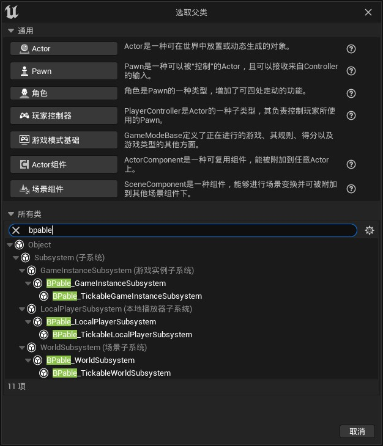
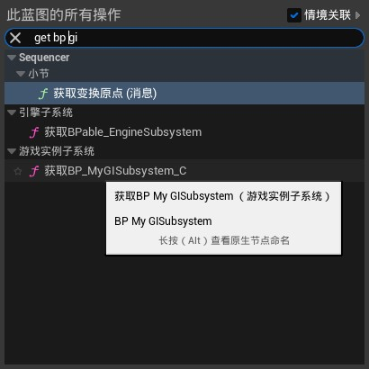
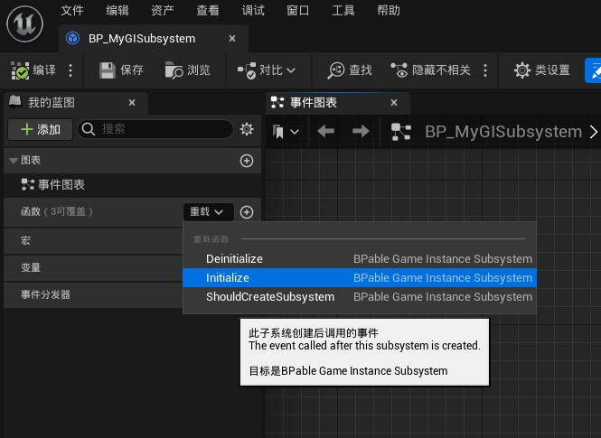
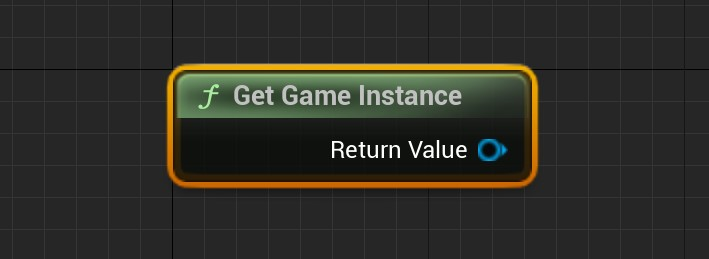
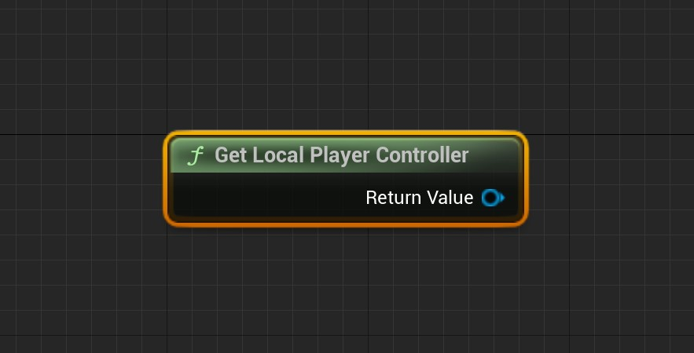

# BlueprintableSubsystem v0.7

- Translated by lpl

## The Profile of Plugin

This plugin provides four subsystems that can be inherited from blueprints：

BPable_GameInstanceSubsystem

BPable_LocalPlayerSubsystem

BPable_WorldSubsystem

BPable_TickableWorldSubsystem

> This method of using  the BPable subsystem that you get in this figure is **illegal**, the proper usage of this plugin is explained down below. The picture above is only for demonstration

Users can obtain the blueprint subsystem by inheriting these base classes directly from the blueprint.

## Step-by-step usage guide

> Take BPable_GameInstanceSubsystem as an example

- Open the project's plugin Settings

  

- Ensure that the BlueprintableSubsystem plugin is enabled

- Create the blueprint class in the Content browser and select BPable_GameInstanceSubsystem as the parent class

  

- Then open the blueprint class of the GameInstanceSubsystem you created and edit it

  

- Call the blueprint Subsystem you created using the Get Subsystem general node in other blueprint classes

  

  

## About BlueprintableSubsystem

###  Usage

In my Blueprint on the left side of the Blueprint class edit window click to overload the corresponding function

### BPable_GameInstanceSubsystem

- Life time

  Follow its' Outer,which is also called UGameInstance.

- Interface

  | Name                  | Graphic                                                      | Explain                                                      |
  | --------------------- | ------------------------------------------------------------ | ------------------------------------------------------------ |
  | Initialize            |  | A event called after this subsystem created                  |
  | Deinitialize          |  | A event called before this subsystem was destoryed           |
  | ShouldCreateSubsystem |  | A function called before this subsystem created  the Implementation of it is not necessary If implement this function,return true to create this subsystem,return false not to create this subsystem |

- Function

  | Name            | Graphic                                                      | Explain                                                      |
  | --------------- | ------------------------------------------------------------ | ------------------------------------------------------------ |
  | GetGameInstance |  | Get the Outer, or UGameInstance, of the game instance subsystem |

  

---

### BPable_LocalPlayerSubsystem

- Life time

  Follow its' Outer,which is also called ULocalPlayer.

- Interface

  | Name                  | Graphic                                                      | Explain                                                      |
  | --------------------- | ------------------------------------------------------------ | ------------------------------------------------------------ |
  | Initialize            |  | A event called after this subsystem created                  |
  | Deinitialize          |  | A event called before this subsystem was destoryed           |
  | ShouldCreateSubsystem |  | A function called before this subsystem created  the Implementation of it is not necessary If implement this function,return true to create this subsystem,return false not to create this subsystem |

- Function

  | Name                     | Graphic                                                      | Explain                                                      |
  | ------------------------ | ------------------------------------------------------------ | ------------------------------------------------------------ |
  | GetLocalPlayerController |  | Get the APlayerController Corresponding to ULocalPlayer from the Outer(ULocalPlayer) of local player's sub system ,  return null when implementing Initialize |

---

### BPable_WorldSubsystem

- Life time

  Following its' Outer，which is also called UWorld.Only appear in Game or PIE.

- Interface

  | Name                  | Graphic                                                      | Explain                                                      |
  | --------------------- | ------------------------------------------------------------ | ------------------------------------------------------------ |
  | Initialize            |  | A event called after this subsystem created                  |
  | PostInitialize        |  | A event called after all UWorldSubsystem calls Initialize    |
  | WorldBeginPlay        |  | A event called when world is ready to start gameplay before the game mode transitions to the correct state and call BeginPlay on all actors |
  | Deinitialize          |  | A event called before this subsystem was destoryed           |
  | ShouldCreateSubsystem |  | A function called before this subsystem created  the Implementation of it is not necessary If implement this function,return true to create this subsystem,return false not to create this subsystem |

------

### BPable_TickableWorldSubsystem

- Life Time

  Inherited from UBPable_WorldSubsystem.Please view relevant contents in the parent class.

- Class defaults

  | Name                 | Explain                                         |
  | -------------------- | ----------------------------------------------- |
  | IsTickEnabled        | Whether to enable Tick                          |
  | IsTickableThenPaused | Whether to enable Tick after the game is paused |

- Interface

  Some interfaces are Inherited from UBPable_WorldSubsystem.Please view relevant contents in the parent class.

  | Name | Graphic                                                      | Explain                                                |
  | ---- | ------------------------------------------------------------ | ------------------------------------------------------ |
  | Tick |  | This event is called every frame after Tick is enabled |

- Function

  | Name                          | Graphic                                                      | Explain                                                 |
  | ----------------------------- | ------------------------------------------------------------ | ------------------------------------------------------- |
  | SetTickEnabled                |  | To set whether to enable Tick                           |
  | IsSubsystemTickEnabled        |  | The enabled value   when return to tick                 |
  | SetTickableWhenPaused         |  | Set whether to tick when the game pause                 |
  | IsSubsystemTickableWhenPaused |  | Report a value that wherher to tick when the game pause |
