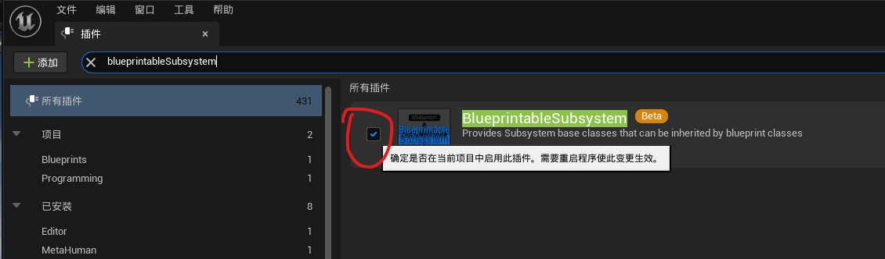
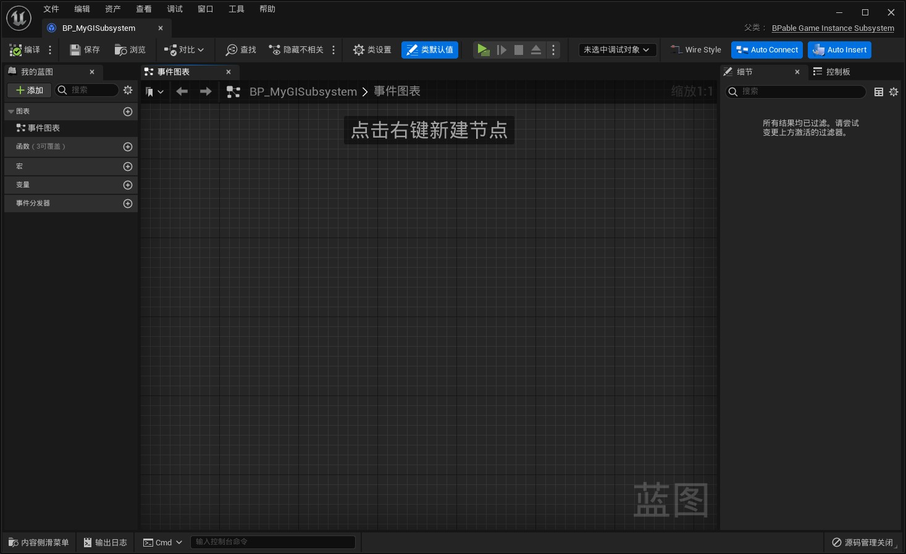
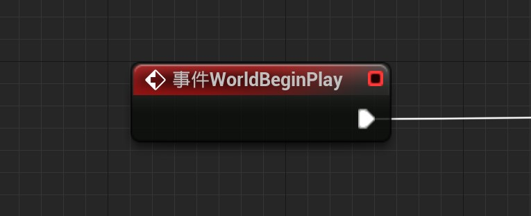

# BlueprintableSubsystem

The corresponding plugin version is v0.5

## Plugin Profile

This plugin provides three subsystems that can be inherited from blueprints：

BPable_GameInstanceSubsystem

BPable_LocalPlayerSubsystem

BPable_WorldSubsystem

> This use of the BPable subsystem that you Get in the figure is **illegal**, and can be used with this plug-in below. The picture above is only for demonstration

Users can obtain the blueprint subsystem by inheriting these three classes directly from the blueprint.

## Step-by-step usage guide

> Take BPable_GameInstanceSubsystem as an example

- Open the project's plugin Settings

  

- Ensure that the BlueprintableSubsystem plugin is enabled

  

- Create the blueprint class in the Content browser and select BPable_GameInstanceSubsystem as the parent class

  

- Open the blueprint class of the GameInstanceSubsystem you created and edit it

  

- Call the blueprint Subsystem you created using the Get Subsystem general node in other blueprint classes

  

  

## About BlueprintableSubsystem Interface

###  Usage

In my Blueprint on the left side of the Blueprint class edit window click to overload the corresponding function

### BlueprintableGameInstanceSubsystem

|         Name          |                           Graphic                            |                           Explain                            |
| :-------------------: | :----------------------------------------------------------: | :----------------------------------------------------------: |
|      Initialize       |  |             Called after this subsystem created              |
|     Deinitialize      |  |            Called before this subsystem destoryed            |
| ShouldCreateSubsystem |  | Called before this subsystem created  Implementation is not necessary If implement this function,return true to create this subsystem,return false not to create this subsystem |
|    GetGameInstance    |  | Get the Outer, or UGameInstance, of the game instance subsystem |

---

### BlueprintableLocalPlayerSubsystem

|           Name           |                           Graphic                            |                           Explain                            |
| :----------------------: | :----------------------------------------------------------: | :----------------------------------------------------------: |
|        Initialize        |  |             Called after this subsystem created              |
|       Deinitialize       |  |            Called before this subsystem destoryed            |
|  ShouldCreateSubsystem   |  | Called before this subsystem created  Implementation is not necessary If implement this function,return true to create this subsystem,return false not to create this subsystem |
| GetLocalPlayerController |  | Get the APlayerController for ULocalPlayer by using the Outer of the local player subsystem, ULocalPlayer. |

---

### BlueprintableWorldSubsystem

|         Name          |                           Graphic                            |                           Explain                            |
| :-------------------: | :----------------------------------------------------------: | :----------------------------------------------------------: |
|      Initialize       |  |             Called after this subsystem created              |
|    PostInitialize     |  |      Called after all UWorldSubsystem calls Initialize       |
|    WorldBeginPlay     |  | Called when world is ready to start gameplay before the game mode transitions to the correct state and call BeginPlay on all actors |
|     Deinitialize      |  |            Called before this subsystem destoryed            |
| ShouldCreateSubsystem |  | Called before this subsystem created  Implementation is not necessary If implement this function,return true to create this subsystem,return false not to create this subsystem |

- Current plugin problems

  If you create a blueprint subclass for BPable_WorldSubsystem, the editor will report an error and crash when you exit the editor.

  But there will be no problems when the game is executed properly (not found yet)