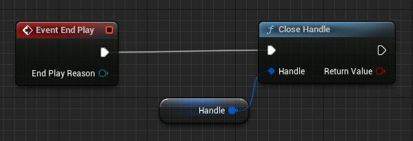
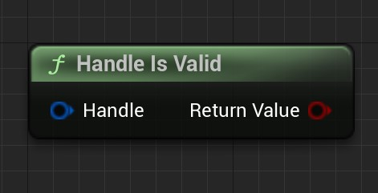
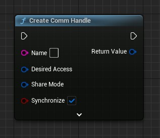

# SerialPortCommunication v0.1

## Plugin Introduction

This plugin expects to provide a set of APIs needed for serial programming in an Unreal C++ programming environment, as well as a set of functions that can be used for serial communication in blueprints.

It currently provides basic serial communication, either synchronously (i.e. blocking the game process) or asynchronously (i.e. not blocking the game thread) with the serial port.

This is the author's first time to write API wrapper related plugins. Please understand if there are any shortcomings.

If you have good suggestions, improvement needs and unexpected errors in use, please send feedback to abc981140197@163.com

## Blueprints

### Use cases in blueprints

The next case will show a simple send/receive with a serial port. The connected serial device is a CH340 and I docked two CH340s to perform a serial send/receive test.


In the above figure, I created a test Actor subclass and did the creation of the serial port after BeginPlay. The values of the two structures passed in are their default values. The Name parameter is the serial port number to be opened, Synchronize is checked by default, in fact, it can be checked for asynchronous operation, here I keep the default value.

The returned result is a handle to the serial port, which is saved as a variable after determining whether it is valid or not.


After creating the handle of the serial port, the initial settings should be made.

In the above figure, the first function performed is to initialize the serial port and allocate the buffer. The second function sets its DeviceControlBlock, whose value is shown below, which is the default value. The third function sets its timeout parameter. The value of the timeout setting structure passed in is the default value.


After setting all mandatory items, the function is called to empty the buffer of this handle. The PurgeAction passed in is the default value



**Don't forget to close the serial port! **Written here for simple testing at the EndPlay of this Actor.


AsyncWriteHandle can be called to write the serial port handle asynchronously during the valid period of the handle.


AsyncReadHandle can be called to read the serial port handle asynchronously during the valid period of the handle

---

### Blueprints API

#### Types

- Handle

  Handle, corresponding to Windows::HANDLE, which holds a void pointer inside.

  

- DesiredAccess

  Used to indicate the type of access to the handle serial port

  

- ShareMode

  Used to indicate the shared mode of the handle serial port, the serial port is generally set to Exclusive

  

- DeviceControlBlock

  Device control block, corresponding to the _DCB structure of the windows api

  

- CommTimeouts

  Timeout setting, corresponding to the _COMMTIMEOUTS structure of the windows api

  

- CommStat

  Serial port status

  

- PurgeAction

  Buffer clear operation.

  

- EventMask

  Serial port event masking

  

- CommErrors

  Serial port error

  

- Overlaped

  Overlap operation, generally used for asynchronous execution of handles. It is not recommended to use it, as the plugin already provides an asynchronous execution version.

  

#### Functions


蓝图节点的解释将不在此处解释，在蓝图中这些节点的引脚部分有注释。

| 函数名                   | 图表                                                         | 函数简述                                                     |
| ------------------------ | ------------------------------------------------------------ | ------------------------------------------------------------ |
| Convert Handle to String |  | 将句柄转化为字符串。<br />其结果为Handle内部的void指针的地址值。 |
| Handle Is Valid          |  | 返回一个Handle是否有效。                                     |
| Handle Is Valid          |  | 为上述函数的执行分支版本。                                   |
| Create Comm Handle       |  | 创建串口的句柄。<br />Synchronize为真时，仍可进行异步操作。  |
| Setup Comm               |  | 初始化串口，并分配缓冲区。                                   |
| Close Handle             |  | 关闭句柄。                                                   |
| Get Last Error Code      |  | 获取最后的错误码，该函数最终是GetLastError()的包装。错误码又该函数返回，详情请网络搜索该函数的返回值代表的含义。 |
| Clear Comm Error         |  | 清除串口错误。并获取串口的错误和状态。                       |
| Get Comm Control Block   |  | 获取串口的Device Control Block。                             |
| Set Comm Control Block   |  | 设置串口的Device Control Block。                             |
| Build Comm DCB           |  | 通过字符串构建串口DCB结构体。该函数为BuildCommDCB()的包装。具体的构建规则请网络搜索。 |
| Convert String to DCB    |  | 该函数为上述函数的Convert版本                                |
| Purge Comm               |  | 清空串口缓冲区。                                             |
| Flush Comm Buffers       |  | 刷新串口的缓冲区                                             |
| Read Handle              |  | 同步地读串口                                                 |
| Async Read Handle        |  | 异步地读串口                                                 |
| Write Handle             |  | 同步地写串口                                                 |
| Async Write Handle       |  | 异步地写串口                                                 |
| Get Overlapped Result    |  | 获取重叠操作的结果。该函数是GetOverlappedResult()的包装。一般用于等待获取异步操作的结果。bWait为真时阻塞线程。建议不使用该函数，应该使用Async版本的函数。如上面的Async Read Handle节点。 |
| Get Comm Timeouts        |  | 获取串口的超时参数。                                         |
| Set Comm Timeouts        |  | 设置串口的超时参数。                                         |
| Get Comm Event Mask      |  | 获取串口的事件遮罩                                           |
| Set Comm Event Mask      |  | 设置串口的事件遮罩                                           |
| Wait Comm Event          |  | 等待串口事件响应，这是一个同步操作。一般情况下请使用异步操作。 |
| Async Wait Comm Event    |  | 等待串口事件响应，这是一个异步操作。                         |


## CPP

### Use cases in CPP

First, you need to add a dependency to the module of the function library that uses the plugin.

For example, in this example, I will test the serial communication in a project file.

Build.cs file of my project file and add a field "SerialPortCommunication" to the PublicDependencyModuleNames list so that I can use the module's symbols in my project code.

```c#
PublicDependencyModuleNames.AddRange(new string[] { "Core", "CoreUObject", "Engine", "InputCore" ,"SerialPortCommunication"});
```

Then I created a subclass of Actor for testing serial communication.

After successful creation, add the following to the header file

```c++
#include "WindowsCommProcessTypes.h"
```

and added three function declarations and a handle variable to the class.

```c++
#pragma once

#include "CoreMinimal.h"
// Add include
#include "WindowsCommProcessTypes.h"
#include "GameFramework/Actor.h"
#include "COMActorTest.generated.h"

UCLASS()
class YOURPROJECT_API ACOMActorTest : public AActor
{
	GENERATED_BODY()

public:
	ACOMActorTest();

protected:
	virtual void BeginPlay() override;

	FHandle Handle;

public:
	virtual void BeginDestroy() override;

	// Do Async Read
	UFUNCTION(CallInEditor)
	void AsyncRead();

	// Do Async Write
	UFUNCTION(CallInEditor)
	void AsyncWrite();

	// Receive Async Read
	UFUNCTION()
	void Print(FString String);
};
```

Then I implement it in the cpp file.

```c++
#include "COMActorTest.h"

#include "AsyncReadHandleAction.h"
#include "AsyncWriteHandleAction.h"
#include "WindowsCommProcess.h"

ACOMActorTest::ACOMActorTest()
{
   PrimaryActorTick.bCanEverTick = false;
}

void ACOMActorTest::BeginPlay()
{
   Super::BeginPlay();

   // Create Handle and Open Comm.
   Handle = FWindowsCommProcess::CreateCommHandle("COM5");

   // If it is not valid then return.
   if (!Handle)
   {
      return;
   }

   // Setup Comm Begin
   FWindowsCommProcess::SetupComm(Handle);
   FWindowsCommProcess::SetCommControlBlock(Handle, FDeviceControlBlock());
   FWindowsCommProcess::SetCommTimeouts(Handle, FCommTimeouts());
   // Setup Comm End

   // Clear Buffer
   FWindowsCommProcess::PurgeComm(Handle);

   // Print Log
   UE_LOG(LogTemp, Warning, TEXT("Handle Open Success"));
}

void ACOMActorTest::BeginDestroy()
{
   Super::BeginDestroy();

   // Make sure the serial port is closed.
   if (Handle)
   {
      FWindowsCommProcess::CloseHandle(Handle);
   }
}

void ACOMActorTest::AsyncRead()
{
   if (!Handle)
   {
      return;
   }

   // Create asynchronous read execution objects.
   auto Object = UAsyncReadHandleAction::AsyncReadHandle(Handle);
   
   // Binding delegates to receive callbacks.
   Object->OnReadCompleted.AddDynamic(this, &ACOMActorTest::Print);

   // Performing asynchronous operations.
   Object->Activate();
}

void ACOMActorTest::AsyncWrite()
{
   if (!Handle)
   {
      return;
   }
   
   // Execute asynchronous operations directly after creating an asynchronous write object.
   UAsyncWriteHandleAction::AsyncWriteHandle(Handle, "CppComTest")->Activate();
}

void ACOMActorTest::Print(FString String)
{
   // Callback function for printing the result after asynchronous reading.
   UE_LOG(LogTemp, Warning, TEXT("%s"), *String);
}
```

### CPP API

---

#### Cautions

In the code file you can find two sets of key files, which are

```
WindowsCommProcessTypes.h
WindowsCommProcess.h
```

and

```
CommTypesForBlueprint.h
CommFunctionLibrary.h
```

The former set of files are the files that can be used for Unreal C++ serial programming use and contain the wrapped types and functions. You should use the former set of files for serial programming.

The latter set of files implements the exposure of functions to the blueprint. The types and functions in the latter group are wrapped again in the former group.

The type of the previous set of files should prevail when you are programming the serial port.

If you need to make extensions and want to expose the extended C++ functions to the blueprint, the exposed section should refer to the implementation of the latter set of files.


All types and functions shown in this section will be subject to the definitions within the previous set of files.


Since most of this plug-in is a wrapper for the Windows serial programming API, the vast majority of functions or types will not be explained here. Please see the Windows documentation on serial functions for details.

---

#### Types

```
EDesiredAccessFlag
```

The serial access flag, which can be a combination of multiple values.


```
EShareModeFlag
```

The serial port shared mode flag, which can be a combination of multiple values. For serial ports, the mode is generally exclusive.


```
ECommErrorsFlag
```

The serial port error flag, which can be a combination of multiple values.


```
EEventMaskFlag
```

The serial event flag, which can be a combination of multiple values.


```
EFlagsAndAttributesFlag
```

Serial port property description, which can be a combination of multiple values. For serial ports, generally only Overlapped is useful.


```
EPurgeActionFlag
```

The serial buffer operation flag, which can be a combination of multiple values.

---

```
ECreationDisposition
```

Create an enumeration of operations. For serial ports, generally only OpenExisting is useful.


```
EDTRControl
```

DTR flow control enumeration.


```
ERTSControl
```

RTS flow control enumeration.


```
EParityMode
```

Checksum mode enumeration.


```
EStopBits
```

Stop Bit Enumeration

---

```
FHandle
```

Handle structure. Its interior is a void pointer, a wrapper around Windows::HANDLE, defining the operation in question. It can be created directly in the blueprint.

It can be directly interconverted with Windows::HANDLE.

| FHandle::          | 简介                                        |
| ------------------ | ------------------------------------------- |
| Get()              | 获取内部地HANDLE，即void指针。              |
| IsValid()          | 判断句柄时候有效。                          |
| ToString()         | 转化为字符串，转化内容为内部HANDLE的值。    |
| operator FString() | 转化为字符串的操作符。                      |
| operator bool()    | 转化为布尔的操作符，值是IsValid()的返回值。 |


```
FSecurityAttributes
```

Security attribute. Is an encapsulation of _SECURITY_ATTRIBUTES. Can be directly interconverted.


```
FDeviceControlBlock
```

Device control block. Is a wrapper for _DCB. Can be directly converted to each other.


```
FOverlapped
```

Overlap operation structure. Is an encapsulation of _OVERLAPPED. It can be directly converted to each other.


```
FCommTimeouts
```

Serial supermarket settings. Is a wrapper for _COMMTIMEOUTS. It can be directly converted to each other.


```
FCommStat
```

Serial port state structure, a wrapper for _COMSTAT. It can be directly interconverted.

---

#### Static function library

| FWindowsCommProcess:: | Introduction                                                 |
| --------------------- | ------------------------------------------------------------ |
| CreateFileHandle()    | Create a file handle, generally not used here for serial port handle creation. |
| CreateCommHandle()    | Creates a serial port handle, which is a wrapper around CreateFileHandle. This is generally used to create the handle and open the serial port. |
| SetupComm()           | Initialize the serial port and allocate buffers.             |
| CloseHandle()         | Close handle to close the serial port.                       |
| GetLastError()        | Get the last error.                                          |
| ClearCommError()      | Clear the serial port error.                                 |
| GetCommControlBlock() | Get the control block of the serial port.                    |
| SetCommControlBlock() | Set the control block of the serial port.                    |
| PurgeComm()           | Clears the buffer of the serial port.                        |
| FlushCommBuffers()    | Flush the buffer of the serial port.                         |
| ReadHandle()          | Read handle for reading the serial port.                     |
| WriteHandle()         | Write handle for writing to the serial port.                 |
| GetOverlappedResult() | Gets the result of an overlapping operation, typically used to get the result of an asynchronous operation. |
| GetCommTimeouts()     | Get the timeout setting for the serial port.                 |
| SetCommTimeouts()     | Set the timeout setting for the serial port.                 |
| GetCommEventMask()    | Get the event mask of the serial port.                       |
| SetCommEventMask()    | Set the event mask for the serial port.                      |
| WaitCommEvent()       | Waiting for serial port events.                              |

---

#### Asynchronous Operation Class

| UAsyncReadHandleAction:: | Introduction                                                 |
| ------------------------ | ------------------------------------------------------------ |
| staitc AsyncReadHandle() | Factory method to create a UAsyncReadHandleAction object.    |
| Activate()               | Activating. After activating, asynchronous operations are performed. If the object has not executed the function, the asynchronous operation will not be executed. After the asynchronous operation is complete, it is called back and destroyed. |
| OnReadCompleted          | A callback that is executed when the read is complete.       |


| UAsyncWriteHandleAction:: | Introduction                                                 |
| ------------------------- | ------------------------------------------------------------ |
| static AsyncWriteHandle() | Factory method to create a UAsyncWriteHandleAction object.   |
| Activate()                | Activating. After activating, asynchronous operations are performed. If the object has not executed the function, the asynchronous operation will not be executed. After the asynchronous operation is complete, it is called back and destroyed. |
| OnWriteCompleted          | A callback that is executed when a write is complete.        |


| UAsyncWaitCommEvent::       | Introduction                                                 |
| --------------------------- | ------------------------------------------------------------ |
| static AsyncWaitCommEvent() | Factory method to create a UAsyncWaitCommEvent object.       |
| Activate()                  | Activating. After activating, asynchronous operations are performed. If the object has not executed the function, the asynchronous operation will not be executed. After the asynchronous operation is complete, it is called back and destroyed. |
| OnWaitEventActivated        | A callback that is executed after a serial port event is triggered. |

