# ThreadExecutionBlueprintNode v1.2

- Add the node to execute ticks a certain number of times based on a given index range.
- Add repeat execution multiple times in one tick, and the repeat execution number supports fixed and dynamic execution number. Dynamic execution times are determined by the time spent on the last execution.
- The game thread execution node is replaced, the original node is deprecated due to thread safety issues and a new node takes its place.

## Plugin Introduction

Multi-threaded programming is used to perform computational tasks that cause the main thread (i.e., the game thread) to block, and placing these tasks in other threads does not block the main thread. This solves the problem of blocking caused by computationally loaded tasks in the game.

This plugin provides multiple blueprint nodes to quickly create and execute multi-threaded tasks with ease of use and low performance consumption.

**The thread execution nodes provided by this plugin are applicable to:**

- Purely mathematical calculations
- Radiation Detection
- Data processing

**The thread execution nodes provided by this plugin do not apply to:**

- create an object

## Quick Use

Find the category by right-clicking the Thread keyword in the Event Graph

Select the Create Thread Exec Tick node in it.

A simple use case is shown below. In this example diagram, the nodes other than the Create Thread Exec Tick node are demo nodes and are not nodes contained in this plugin.MainProcess1 is the pre-processing and MainProcess2 is the post-processing after executing the node.DoAlgorithm is the task executed in the other thread.CallBack is the callback task executed after the Loop jumps out.

This use case creates a threaded task that executes the algorithm function once per tick. The algorithm function returns a Boolean value of whether it is completed or not, which is used to determine whether to interrupt the loop tick, close the thread, and execute Completed.

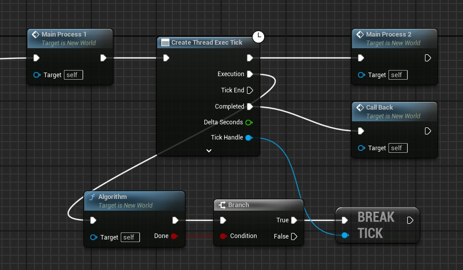

## Pre-requisite knowledge

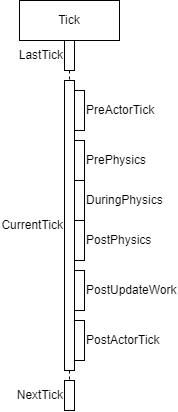

The figure above is a simplified diagram of the main content executed within a Tick. The order of execution is from top to bottom. The first level of structure is the main tick, and the next level is the different groups of ticks within the tick. These groups will be executed serially. In addition, this main tick thread takes place in the game thread.

The figure above shows that within a tick, there are multiple partial ticks executing one after another. Most of the parts about the game logic are placed between PrePhysics and PostUpdateWork.

In between ticks, sometimes UE also performs garbage collection (GC). So putting important operations on game objects in places other than the group of ticks where the game logic is allowed to be computed often leads to crashes.

The following node will provide safe execution of game logic in other threads, but its implementation is also based on synchronization with the main Tick.

## Node Directory

## CreateThreadExecOnce

- This node is used to create a thread and execute a task once. 
- It can be called from anywhere. (Same as below)
- The **lifetime** of the thread depends on the execution time of the thread and the **lifetime** of the external Object. If the thread execution is interrupted due to the destruction of an external Object, **Completed** will not be executed. (Same as below)

| Node Pins                | Description                                                  |
| ------------------------ | ------------------------------------------------------------ |
| Default Execution Input  | Threads will be created after execution. (Same as below)     |
| bLongTask                | If true, a separate thread is created. This is generally used for time-consuming tasks. If false, asynchronous threaded tasks are created, which are generally used for short tasks. Creating short task threads consumes the least amount of performance. (Same as below) |
| ExecuteWhenPaused        | Whether to continue execution when the game is paused        |
| ThreadName               | Custom thread name, or default if not None                   |
| TimingPair               | Determine the right time to start and the right time to end when executing within a frame. |
| Default Execution OutPut | Pins that will be executed after the thread is created. (Same as below) |
| Execution                | Pins that will be executed once by the created thread.       |
| Completed                | The pin that will be executed at the end of the Exection event stream, which will be executed in the game thread |

- Executive Explanation

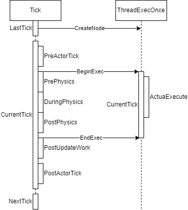

The figure above shows the timing of the execution of CreateThreadExecOnce.

When you execute the node, an execution object is created first, but at this point (LastTick) the task is not executed immediately. Instead, it waits until the next tick. to the next tick (CurrentTick), it will control the start of execution and ensure the end of the task according to the parameters (BeginIn, EndBefore) you passed in when creating the task for that thread. As shown in the figure, according to the execution timing parameters passed in, we start executing the task when the tick executes to PrePhysics. So the task in another thread is triggered to start execution.

When the execution reaches PostUpdateWork, because our EndBefore parameter is PostUpdateWork, the thread task is asked if the execution is finished. If the execution is finished, then the interrogation operation ends immediately and the tick continues immediately afterwards. If the execution is finished, it will wait until the thread task is finished, then return, and then tick will continue execution.

From the above you can see that there are several points of attention!

- Once the task execution part of the execution node do not delegate too many tasks, otherwise it may lead to the next tick's task waiting to be extended, thus leading to the next tick stuck.
- BeginIn, EndBefore should be carefully selected. BeginIn is the timing of the start of the task, after the execution of the thread task will immediately start. endBefore is waiting for the end of the thread execution. These two optional values can be selected very widely, such as BeginIn choose PreActorTick, EndBefore choose PostActorTick. but note! The safe execution timing is generally between PrePhysics and PostUpdateWork. The broader execution timing is only a special option provided by the plugin. It is only used for special needs. However, a wider execution timing does not guarantee that the program will run properly and stably. If this causes your program to crash, shorten the execution timing.
- You can see that the task we give to the thread execution node will be executed in another thread, but this does not necessarily meet your needs. The reason is that the execution of some functions will require that they be executed only within the game thread, so handing such nodes to a thread node to execute will likely result in a crash. This time I can't make any guarantees, as it is related to the writer of the function being executed (perhaps EpicGames).

### Macros

This macro node is a simplified version of CreateThreadExecOnce. This node ensures that it will not be executed repeatedly. That is, when the node is executed once, it creates a thread task to the next tick, and repeated execution of the node will do nothing until the created thread task is executed. Same as below

------

## CreateGameThreadExecOnce

- This node is used to execute the event flow in the main game thread. For example: Print String is executed in the main thread via this node in other threads.
- Functions such as printing that depend on the main thread should not be executed in other threads. If you get an error or crash, try to move the function to the main game thread

| Node Pins      | Description                                                  |
| -------------- | ------------------------------------------------------------ |
| GameThreadExec | Pass in a delegate that you want to execute in the game thread |

------

## CreateThreadExecTick

- This node is used in other threads to execute once with each Tick of the game. This is a special kind of loop whose loop body is executed at each Tick. When the task ends early it does not go directly to the next loop, but waits for the next Tick to initiate execution.

| Node Pins      | Description                                                  |
| -------------- | ------------------------------------------------------------ |
| TickEnabled    | The value of TickEnabled at the beginning of the Tick thread. If it is true, the Tick is executed immediately after the node; if it is false, the Tick is not executed until the end or the value of its TickEnabled is true. |
| TcikWhenPaused | Whether to execute Tick when the game is paused              |
| bLongTask      | If true, a separate thread is created. Separate threads are generally used to perform long tasks. If false, the threaded task is created. Its generally used for executing short tasks. The performance consumption when creating short task threads is the least. (Same below) |
| ThreadName     | Custom thread name, or default if not None                   |
| TimingPair     | Determine the right time to start and the right time to end when executing within a frame. |
| Behavior       | Tick behavior structure. Used to determine the number of static and dynamic executions of a Tick at execution time. |
| Execution      | Pins executed at each tick                                   |
| TickEnd        | Pins that are executed at the end of an all-at-once Execution |
| Completed      | Pin executed when Tick execution jumps out                   |
| DeltaSeconds   | Parameters for Tick pin execution. is the delta time of the current Tick |
| TickHandle     | TickHandle is the handle to this tick. This handle allows you to control the execution of the tick |

- Executive Explanation

The execution timing is actually similar to CreateThreadExecOnce. Only after the execution is finished it will continue to repeat the operation at the next tick.

### Helper Functions

| Name                  | Graph                                                        | Description                                                  |
| --------------------- | ------------------------------------------------------------ | ------------------------------------------------------------ |
| BreakNextTick         |  | Break the execution of the next Tick and jump out            |
| IsTicking             |  | Is the task being performed                                  |
| IsTickable            |  | Get the Tickable value of a Tick thread                      |
| SetTickable           | 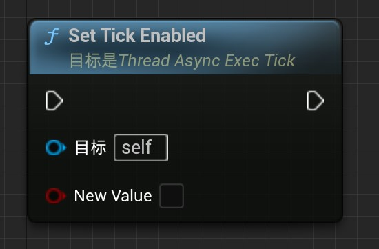 | Sets the Tickable value of a Tick thread. If set to true, the Tick is executed. if set to false, the Tick is not executed and does not jump out. Can be reset to true in the future to continue executing Tick |
| IsTickableWhenPaused  | 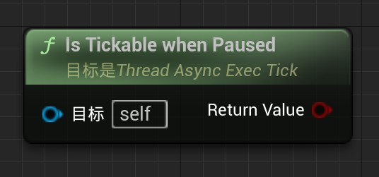 | Get the TickableWhenPaused value of a Tick thread            |
| SetTickableWhenPaused |  | Set the value of whether the Tick can be executed when the game is paused |
| GetTimingPair         |  | Getting the timing of the thread Tick pair                   |
| GetBehavior           | 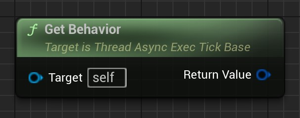 | Get the behavioral definition of the thread Tick             |

### Macros

- This is a macro that wraps CreateThreadExecTick. The purpose of its wrapping is the same as CreateThreadExecOnce.

------

## CreateThreadExecTickForLoop

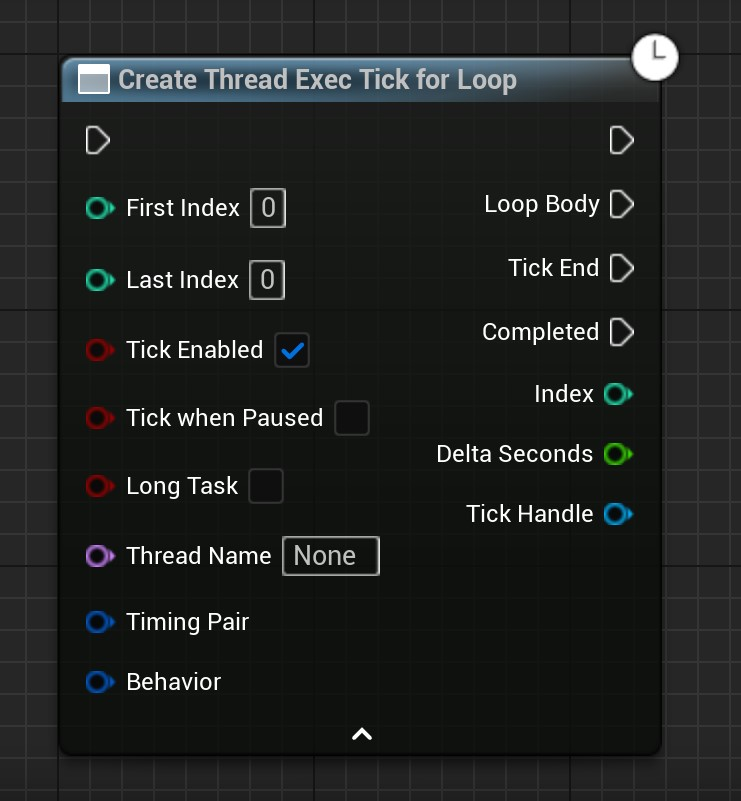

- This node function is an extension of CreateThreadExecTick. It has a limited number of Tick executions. It will be executed sequentially from FirstIndex to LastIndex (including LastIndex)

Only the pins that differ from the CreateThreadExecTick are explained below

| Node Pins  | Description                               |
| ---------- | ----------------------------------------- |
| FirstIndex | The index of the first loop when looping. |
| LastIndex  | The index of the last loop when looping.  |
| Index      | The index of the current loop             |

### Helper Functions

| Name          | Graph                                                        | Description                              |
| ------------- | ------------------------------------------------------------ | ---------------------------------------- |
| GetCurrent    |  | Get the current index of the thread Loop |
| GetFirstIndex | 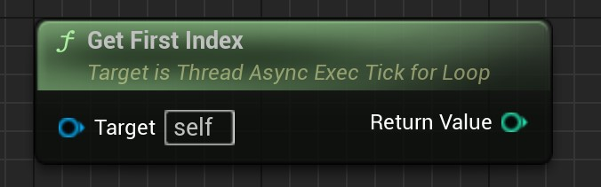 | Get the first index of the thread Loop   |
| GetLastIndex  | 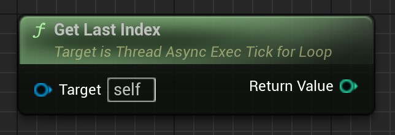 | Get the last index of the thread Loop    |

### Macros

- This is a macro wrapper for CreateThreadExecTickForLoop. The purpose of the wrapper is the same as CreateThreadExecOnce.

------

## ThreadExecTickForeach

- The node needs no introduction. It is traversed based on the elements of an array. The default traversal behavior is to traverse one element per Tick. Other traversal behaviors can be used through the Behavior struct parameter

## Unsafely Thread Execution Nodes

### ThreadExecOnceUnsafely

Unsafe to execute once. This node is poorly developed and has many problems. Be careful with its use!

It doesn't have a mechanism to synchronize with the game thread Tick like the aforementioned Once node, so he'll ignore that and just force the thread task.

If you put some game logic into it, it will probably cause a crash.

It is not recommended.

### ThreadExecLoopUnsafely

Ditto, not recommended.

### ThreadExecTickUnsafely

Ditto, not recommended.

## Utility

### Utilities

| Name                 | Graph                                                        | Description                                                  |
| -------------------- | ------------------------------------------------------------ | ------------------------------------------------------------ |
| GetCurrentThreadID   |  | Get the thread ID of the thread executing the node           |
| GetCurrentThreadName | 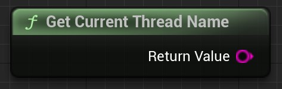 | Get the name of the thread executing the node                |
| SetThreadName        | 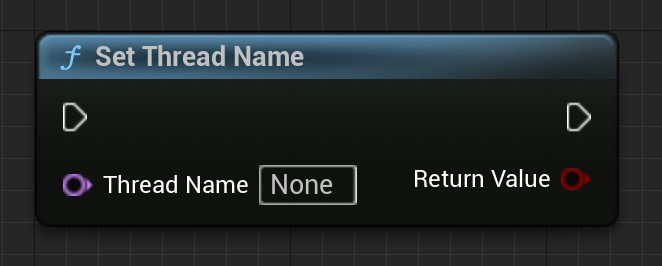 | Set the name of the current thread                           |
| IsGameThread         |  | Gets the value of whether the thread executing the node is a game thread |
| IsGameThread         | 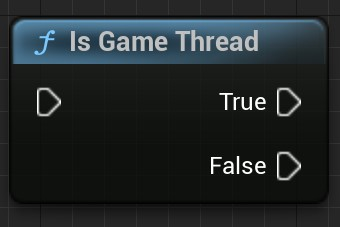 | A branching option. The condition is whether the thread executing the node is a game thread |

------

### Subsystem

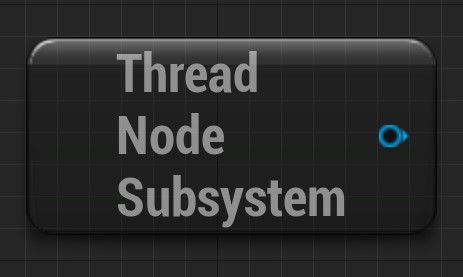

This subsystem is designed to provide global information about thread nodes, and the current version only provides the ability to get all thread nodes.

- Callable functions

| Name                      | Graph                                                        | Description                                                  |
| ------------------------- | ------------------------------------------------------------ | ------------------------------------------------------------ |
| Get All Thread Exec Nodes | 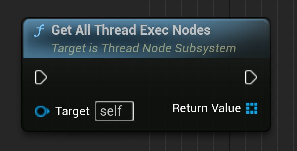c | Gets all thread execution nodes, returning an array with elements of type ThreadAsyncExecBase reference. The current version of this type of reference has few functions that can be called. |
| Get All Thread Exec Onces |  | Gets all thread execution once nodes, returning an array with elements of type ThreadAsyncExecOnce reference. |
| Get All Thread Exec Ticks |  | Gets all thread execution once nodes, returning an array with elements of type ThreadAsyncExecTick reference. |

## Types

### EThreadTickTiming

- 该Tick时机戳枚举用于表示在一次Tick内的不同时间。

| Enumerated Value | Description                            |
| ---------------- | -------------------------------------- |
| PreActorTick     | Before all Actors are ticked           |
| PrePhysics       | Before performing physical simulations |
| DuringPhysics    | When performing physical simulations   |
| PostPhysics      | After performing physical simulations  |
| PostUpdateWork   | Until Tick is finished.                |
| PostActorTick    | After all Actors have finished Tick    |

------

### FThreadExecTimingPair

- This structure contains two tick timestamps

| Member Name | Type              | Description       |
| ----------- | ----------------- | ----------------- |
| BeginIn     | EThreadTickTiming | Start at ......   |
| EndBefore   | EThreadTickTiming | End before ...... |

------

### FThreadTickExecBehavior

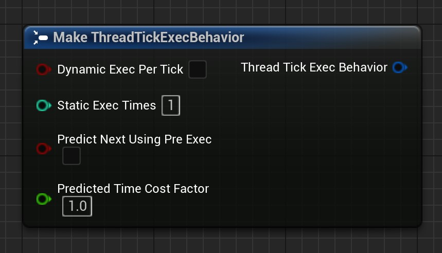

- This structure is used to describe the behavior of the Tick when it is executed. The default value will cause the thread Tick to execute once per frame.

| Member Name             | Type  | Description                                                  |
| ----------------------- | ----- | ------------------------------------------------------------ |
| bDynamicExecPerTick     | bool  | Whether or not to enable dynamic execution times per frame. If enabled, it will be executed multiple times per frame, depending on the available elapsed time. It will continue to be executed repeatedly at the beginning of the thread Tick until the end of the thread Tick. |
| StaticExecTimes         | int32 | Valid when bDynamicExecPerTick is false. Fixed number of executions per frame for static execution. |
| PredictNextUsingPreExec | bool  | Valid when bDynamicExecPerTick is true. When executing once, whether to predict whether to continue repeating the execution based on the elapsed time of the last execution and the current remaining available elapsed time. |
| PredictedTimeCostFactor | float | Valid when bDynamicExecPerTick and PredictNextUsingPreExec are both true. The value is used as a factor of the last execution elapsed time. A value of 1 means that the time of the last execution is used as a reference to predict whether the remaining elapsed time can be allowed again. A value greater than 1 will cause dynamic execution to end prematurely within a tick. A value of less than 1 may cause the dynamic execution to block the game thread a little, causing it to go idle. |
