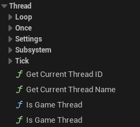
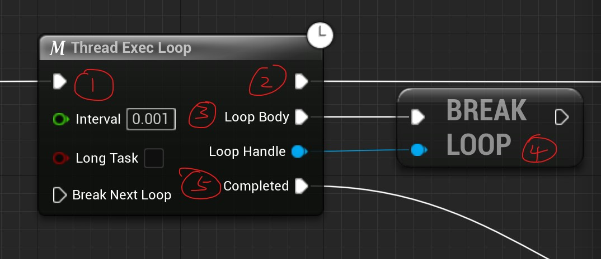
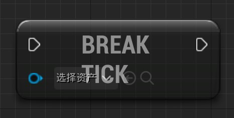
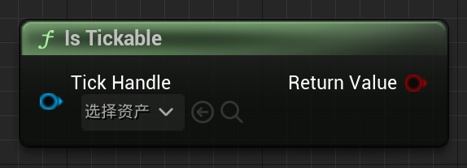
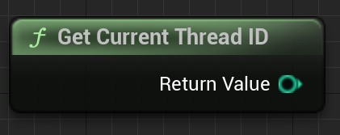

# ThreadExecutionBlueprintNode v0.5

## Plugin Introduction

Multi-threaded programming is used to perform computational tasks that cause the main thread (i.e., the game thread) to block, and placing these tasks in other threads does not block the main thread. This solves the problem of blocking caused by computationally loaded tasks in the game.

This plugin provides multiple blueprint nodes to quickly create and execute multi-threaded tasks with ease of use and low performance consumption.

## Quick Use

Find the category by right-clicking the Thread keyword in the Event Graph

Select one of the Try Thread Exec Once nodes.

A simple use case is as follows. MainProcess1 is the pre-process, MainProcess2 is the post-process after the execution of the node. DoAlgorithm is the task executed in other threads. CallBack is the callback task executed after the Loop jumped out.

## Node Directory

## ThreadExecOnce

### Main Nodes

- This node is used to create a thread and execute a task once. 
- It can be called from anywhere. (Same as below)
- The **lifetime** of the thread depends on the execution time of the thread and the **lifetime** of the external Object. If the thread execution is interrupted due to the destruction of an external Object, **Completed** will not be executed. (Same as below)

| Node Pins                | Description                                                  |
| ------------------------ | ------------------------------------------------------------ |
| Default Execution Input  | Threads will be created after execution. (Same as below)     |
| bLongTask                | If true, a separate thread is created. This is generally used for time-consuming tasks. If false, asynchronous threaded tasks are created, which are generally used for short tasks. Creating short task threads consumes the least amount of performance. (Same as below) |
| Default Execution OutPut | Pins that will be executed after the thread is created. (Same as below) |
| Execution                | Pins that will be executed once by the created thread.       |
| Completed                | The pin that will be executed at the end of the Exection event stream, which will be executed in the game thread |

------

- This node is used to execute the event flow in the main game thread. For example: Print String is executed in the main thread via this node in other threads.
- Functions such as printing that depend on the main thread should not be executed in other threads. If you get an error or crash, try to move the function to the main game thread

| Node Pins | Description                             |
| --------- | --------------------------------------- |
| Execution | Execute the pin in the main game thread |

------

### Macros

- This is a macro that wraps ThreadExecOnce. The basic function is the same as it. The difference is that when this has already been executed once and the thread task is running, executing the node again will be blocked so that no new thread task is created. It can only be executed again when the original thread task is completed.

## ThreadExecLoop

### Main Nodes

- This node is used to loop through other threads for execution. If you need loop execution, do not use the ThreadExecOnce node plus WhileLoop to achieve it. Doing so is not possible because the blueprint has a limit on the number of one-time node executions.

| Node Pins  | Description                                                  |
| ---------- | ------------------------------------------------------------ |
| Interval   | The wait time between the previous loop and the next loop. This is used to prevent threads from blocking. No problems caused when this value is 0 have been found so far |
| LoopBody   | The loop body that will be executed for each loop            |
| Completed  | Pins that are executed after the loop body breaks            |
| LoopHandle | LoopHandle is the handle to this loop. This handle allows you to control the execution of the loop |

------

### Helper Functions

- This function is used to break a loop. If the loop is executing, it will jump out of the loop before executing the next one

Example.

- In the example, the order of execution is as above. Number two will perform the rest of the tasks in the game thread. The created thread will loop to execute pin 3. The first loop in the figure then calls the function that break the loop and continues executing the rest of the node until the end. On the second execution of the loop body because it was broken, the loop is jumped out and Completed is executed.

### Macros

- This is a macro that wraps ThreadExecLoop. The purpose of its wrapping is the same as ThreadExecOnce.

## ThreadExecTick

### Main Nodes

- This node is used in other threads to execute once with each Tick of the game. This is a special kind of loop whose loop body is executed at each Tick. When the task ends early it does not go directly to the next loop, but waits for the next Tick to initiate execution.

| Node Pins      | Description                                                  |
| -------------- | ------------------------------------------------------------ |
| TickEnabled    | The value of TickEnabled at the beginning of the Tick thread. If it is true, the Tick is executed immediately after the node; if it is false, the Tick is not executed until the end or the value of its TickEnabled is true. |
| TcikWhenPaused | Whether to execute Tick when the game is paused              |
| Tick           | Pins executed at each tick                                   |
| Completed      | Pin executed when Tick execution jumps out                   |
| DeltaSeconds   | Parameters for Tick pin execution. is the delta time of the current Tick |
| TickHandle     | TickHandle is the handle to this tick. This handle allows you to control the execution of the tick |

### Helper Functions

| Name                  | Graph                                                        | Description                                                  |
| --------------------- | ------------------------------------------------------------ | ------------------------------------------------------------ |
| BreakNextTick         |  | Break the execution of the next Tick and jump out            |
| IsTickable            |  | Get the Tickable value of a Tick thread                      |
| SetTickable           |  | Sets the Tickable value of a Tick thread. If set to true, the Tick is executed. if set to false, the Tick is not executed and does not jump out. Can be reset to true in the future to continue executing Tick |
| IsTickableWhenPaused  |  | Get the TickableWhenPaused value of a Tick thread            |
| SetTickableWhenPaused |  | Set the value of whether the Tick can be executed when the game is paused |

### Macros

- This is a macro that wraps ThreadExecTick. The purpose of its wrapping is the same as ThreadExecOnce.

## Utility

| Name                 | Graph                                                        | Description                                                  |
| -------------------- | ------------------------------------------------------------ | ------------------------------------------------------------ |
| GetCurrentThreadID   |  | Get the thread ID of the thread executing the node           |
| GetCurrentThreadName |  | Get the name of the thread executing the node                |
| IsGameThread         |  | Gets the value of whether the thread executing the node is a game thread |
| IsGameThread         |  | A branching option. The condition is whether the thread executing the node is a game thread |
| ThreadWait           |  | Thread waiting. Can only be used for non-game threads. Used to wait for a certain amount of time in other threads. If the node is executed in the game thread it will not make the game thread wait. |

